```{r setup, include=FALSE}
options(htmltools.dir.version = FALSE)
```

```{r xaringan-themer, include=FALSE, warning=FALSE}
xaringanthemer::style_mono_light(base_color = "#ff8000")
```

```{r xaringanExtra-scribble, echo=FALSE}
xaringanExtra::use_scribble()
```

```{r xaringan-logo, echo=FALSE}
xaringanExtra::use_logo(
  image_url = "../assets/pic/320px-UNFPA_logo.svg.png",
  position = xaringanExtra::css_position(bottom = "-3.5em", left = "0.5em")
)
```

 

# Today's agenda


--
<br>


### 1. Global introduction to population modelling

--
<br>

### 2. Presentation of tutorial 1: *how to think about population as a Bayesian?*

---
class: bottom, hide_logo

# Introduction's outline

--
<br>

### 1. Population models in WorldPop

--

### 2. Why Bayesian

--
### 3. Bayesian foundations

--
### 4. Bayesian model estimation

--
### 5. Course outline

--
### 6. Course materials 
<br>

---
class: inverse, left, middle

# Population models at WorldPop

---
class: center, middle

# Goal

---
class: left, middle
background-image: url(day1_presentation_files/pic/background_griddedpop.png) 

## .bg-white[Estimate population locally]

---
class: hide_logo

# Gridded population

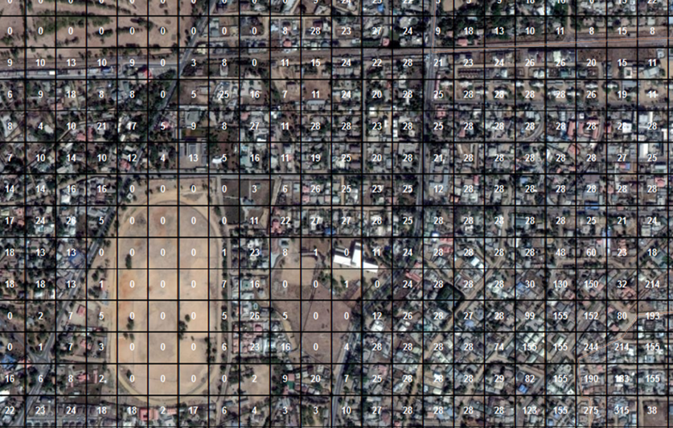

---

# Benefits of gridded population

.pull-left[
### 1. Description of fine spatial variations
]

--

.pull-right[

]
---
# Benefits of gridded population

.pull-left[

### 2. Consistent and comparable format 
-    Identical size
-    Identical shape
-    Constant across time
]

--

.pull-right[
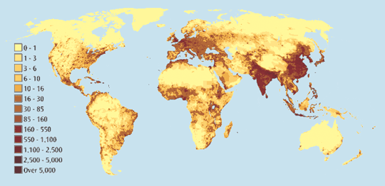

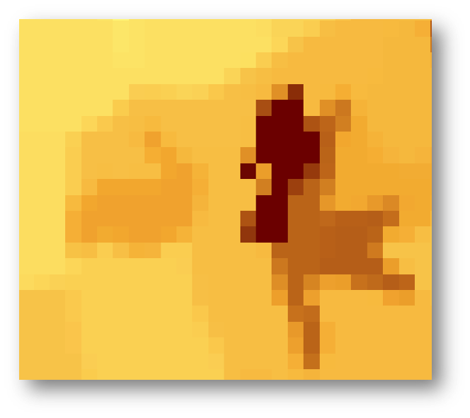
]

---

# Benefits of gridded population


.pull-left[
### 3. Custom spatial aggregation

- Around a point*: health center, school, earthquake center*

- Around a line*: river, roads borders*

- In a zone*: villages, catchment area*
]

--
.pull-right[
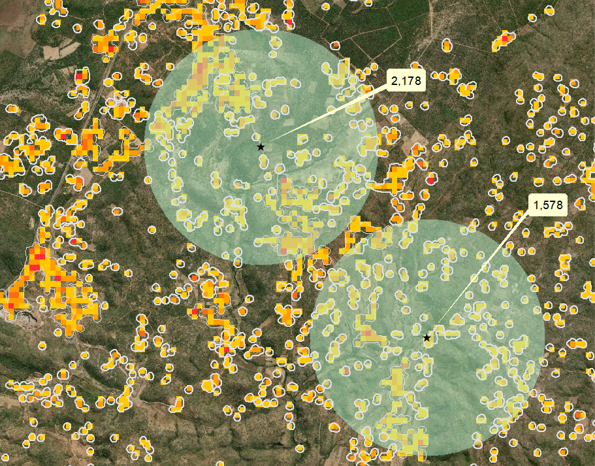
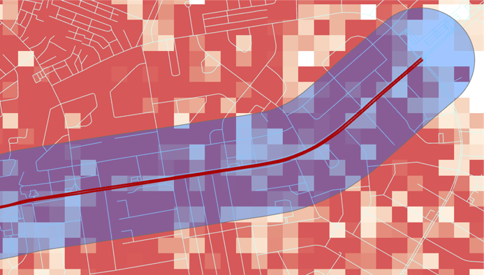
]

---

# Benefits of gridded population


.pull-left[
### 4. Flexible data combination

]

--

.pull-right[
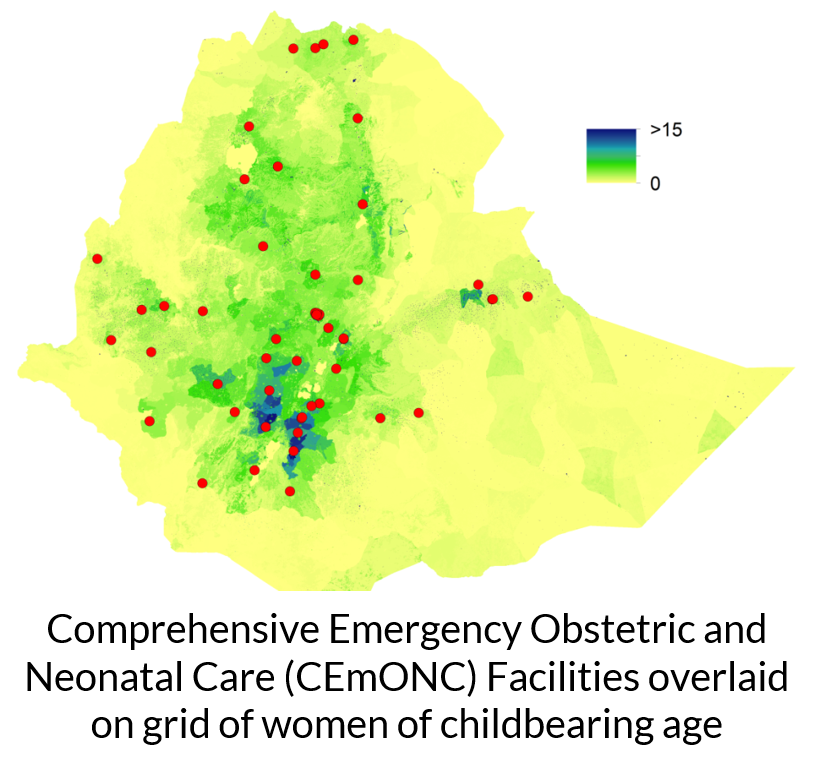

]

---
class: left, middle
background-image: url(day1_presentation_files/pic/background_griddedpop.png) 

## .bg-white[Two types of model]

---
class: inverse, center, middle

# When population data with **full spatial coverage** is available

---
class: center, middle

# Top-down model

---

# Top-down model

<br>
<br>

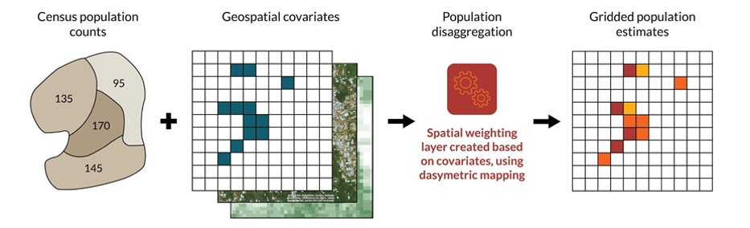
---
# Top-down R tutorial

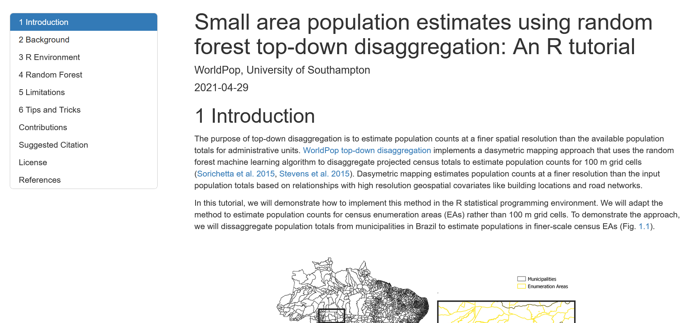


https://htmlpreview.github.io/?https://github.com/wpgp/top-down-tutorial/blob/master/4_tutorial.html


---
class: inverse, center, middle

# When population data with full spatial coverage is **not** available

---
class: center, middle

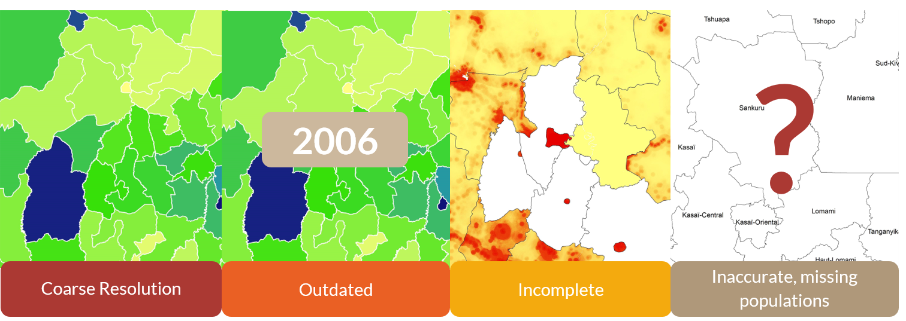

---

# Bottom-up model
<br>

<br>

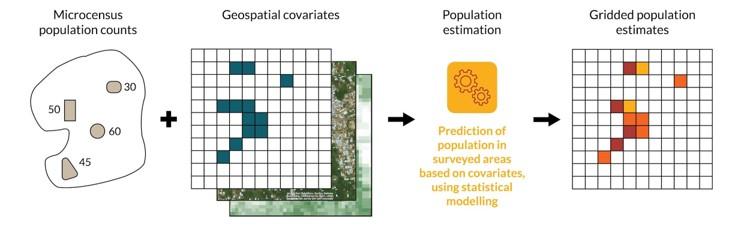

---
# Released models

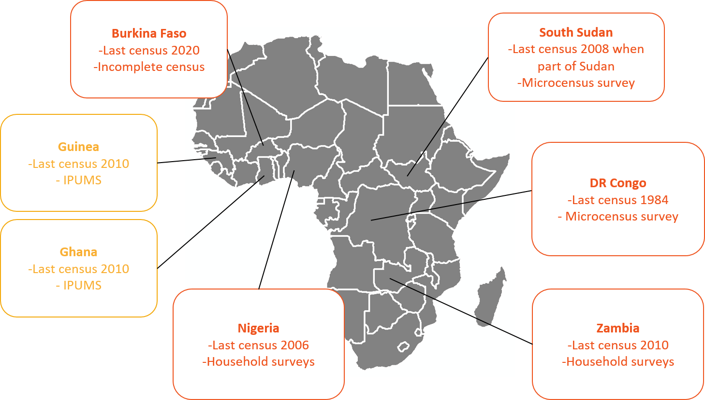


.center[https://wopr.worldpop.org/?/Population]

---
class: left, middle
background-image: url(day1_presentation_files/pic/background_griddedpop.png) 

## .bg-white[Common feature:  &nbsp; ]
## .bg-white[They are all Bayesian models! &nbsp;]

---


class:inverse, left, middle

# Why Bayesian statistics?

---
class: center, middle

# But what is Bayesian statistics?

---
class: center, middle

### 1.  Bayesian statistics are a **knowledge building process**
---
class: hide_logo

# A daily-life example

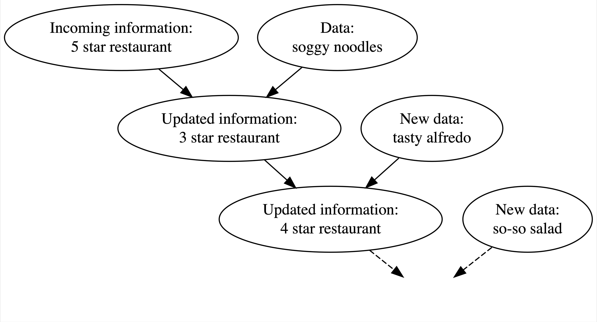

.footnote[[Chapter 1, Bayes Rules! An Introduction to Bayesian Modeling with R ](https://www.bayesrulesbook.com/chapter-1.html)]

---
class: middle, hide_logo


.pull-left[
###Bayesian philosophy: 
1.  having *prior* information about a phenomenon
2.  interpreting incoming data in light of this *prior*
3. concluding with an updated information or *posterior*]

.pull-right[

]

.footnote[[Chapter 1, Bayes Rules! An Introduction to Bayesian Modeling with R ](https://www.bayesrulesbook.com/chapter-1.html)]

---
layout: true
class: hide_logo

# Test your Bayesian thinking

---

.center2[*When flipping a fair coin, we say that ‘the probability of flipping Heads is 0.5.’* 

How do you interpret this probability?

1. If I flip this coin over and over, roughly 50% will be Heads.
2. Heads and Tails are equally plausible.]

.footnote[[Chapter 1, Bayes Rules! An Introduction to Bayesian Modeling with R ](https://www.bayesrulesbook.com/chapter-1.html)]

---

.center2[*An election is coming up and a pollster claims that ‘candidate A has a 0.9 probability of winning.’* 

How do you interpret this probability?

1. If we observe the election over and over, candidate A will win roughly 90% of the time.
2. Candidate A is much more likely to win than to lose.
3. The pollster’s calculation is wrong. Candidate A will either win or lose, thus their probability of winning can only be 0 or 1.]


.footnote[[Chapter 1, Bayes Rules! An Introduction to Bayesian Modeling with R ](https://www.bayesrulesbook.com/chapter-1.html)]

---
.center2[*Consider two claims:* 

*(1) Zuofu claims that he can predict the outcome of a coin flip. 
To test his claim, you flip a fair coin 10 times and he correctly predicts all 10.* 

*(2) Kavya claims that she can distinguish natural and artificial sweeteners.
To test her claim, you give her 10 sweetener samples and she correctly identifies each* 

What do you conclude?

1. You’re more confident in Kavya’s claim than Zuofu’s claim.
2. The evidence supporting Zuofu’s claim is just as strong as the evidence supporting Kavya’s claim.]


.footnote[[Chapter 1, Bayes Rules! An Introduction to Bayesian Modeling with R ](https://www.bayesrulesbook.com/chapter-1.html)]

---
layout:false
class: center, middle

### 2.  Bayesian statistics are a different **perspective on probability**
---
class: hide_logo, middle
# Defining probability

.footnote[[Chapter 1, Bayes Rules! An Introduction to Bayesian Modeling with R ](https://www.bayesrulesbook.com/chapter-1.html)]

<br>
> ### **Bayesian philosophy**: probability measures the *relative plausibility* of an event.

--
> ### **Frequentist philosophy**: probability measures the *long-run relative frequency* of a *repeatable* event.

---
class: center, middle

### 3.  Bayesian statistics are **transparent about the assumptions made**
---
# Bayes rule

$$ \text{posterior} \quad = \quad \frac{\text{prior } \cdot \text{ likelihood}}{\text{normalizing constant}} \; $$

<br> 
**Prior proability model** <br />
It captures our belief about the phenomenon. prior to seeing any data.

**Likelihood**<br />
It represents the range of parameter values accompanied by
the likelihood that each parameter explains the data we are observing.

**Posterior probability model**<br />
It summarises the plausibility of a phenomenon.


---
# Toy example

#### Modeller's question: *Will it rain tomorrow the 27th September 2021 in the UK?*

<br>
--

**Prior proability model**: <br />
It rains 60% of the time in September in the UK.

--

**Likelihood**<br />
It is sunny today and climate models say that weather is stable in 40% of the case.

--

**Posterior probability model** <br />
Knowing the weather of today in the UK and climate models,
we can update the prior information of the weather for the 27th September in the UK.

---
# Balancing data and knwoledge

<br>
<br>

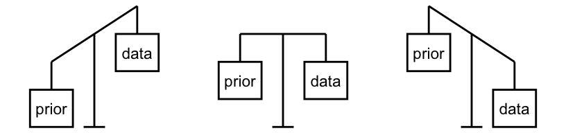

<br> 

--
As we collect more data, priors lose their influence.

.footnote[More details in [Chapter 2, Bayes Rules! An Introduction to Bayesian Modeling with R ](https://www.bayesrulesbook.com/chapter-2.html)
]
---

class: center, middle

### 4.  Bayesian statistics account for the **uncertainty in the model**
---
# Uncertainty quantification

--

### Sources of uncertainty <br />
- Missing predictors
--

- Errors in data collection
--

- Imperfect representativity of the sample
--

- Individual variation

<br> 
--

#### **Parameters are considered as variable and thus have a distribution**

--
#### **Predictions are considered as variable and thus have a distribution**

---
class: center, middle

### 5.  Bayesian models makes you think about your question in terms of **distributions**

---
class: center, middle


#Why Bayesian statistics ?

--
### Principled

--

### Flexible

--

### Good with missing data

--

### Humble

---
class: inverse, middle, center

# Estimating Bayesian models
---
# Markov chain Monte Carlo

#### **Goal**: Approximating the posterior distribution via simulation
--

**Monte Carlo** <br />
Estimate a parameter by generating random numbers and checking if it corrersponds to the structure

--
.pull-right[
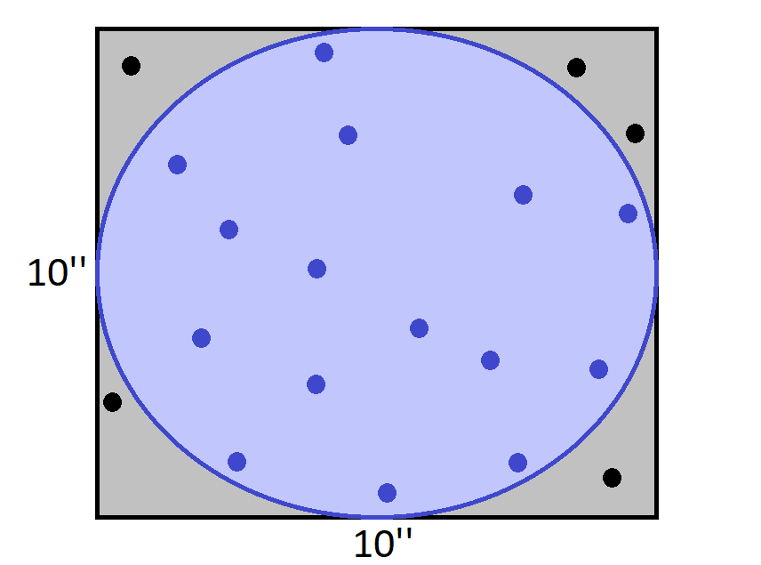
]

---
# Markov chain Monte Carlo

#### **Goal**: Approximating the posterior distribution via simulation

**Monte Carlo** <br />
Estimate a parameter by generating random numbers and checking if it corrersponds to the structure

**Markov chain** <br />
Sequences of samples probabilistically related

---
# Markov chain Monte Carlo

#### **Goal**: Approximating the posterior distribution via simulation

**MCMC** <br />
1. Pick a random parameter value
2. Evaluate how likely the value explains the data given the prior belief and the model
3. Draw another value depending on the goodness of the previous value

--
.pull-right[
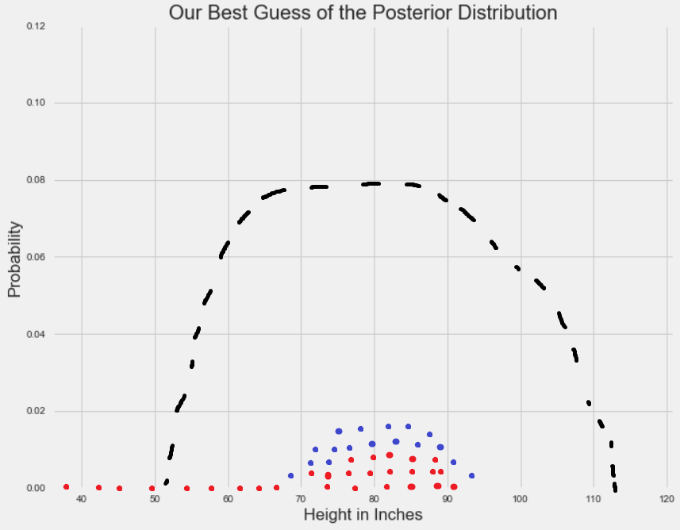
]

<br>

<br>

<br>

<br>

<br>
[A Zero-math introduction to MCMC methods](https://towardsdatascience.com/a-zero-math-introduction-to-markov-chain-monte-carlo-methods-dcba889e0c50)

---
# Stan


[Stan](http://mc-stan.org/) is a probabilistic programming language
for Bayesian estimation

Language- and platform-agnostic back-end  with a
**wide range of front-ends**:
- Shell (“CmdStan”)
- **R (“RStan”) **
- Python (“PyStan”) 
- Matlab (“MatlabStan”)
- Stata (“StataStan”)
- Julia (“JuliaStan”)

Two step compilation process: model in `stan` code, translated to `C++` and compiled in a standalone binary

<br>

.footnote[Stan Development Team. 2021. Stan Modeling Language Users Guide and Reference Manual, 2.27. https://mc-stan.org
]
---
class: inverse, middle, center

# Supporting readings
---

# Supporting readings

1. [Bayes Rules! An Introduction to Bayesian Modeling with R ](https://www.bayesrulesbook.com/)
by Alicia A. Johnson, Miles Ott, Mine Dogucu

--

2. [An Introduction to Bayesian Data Analysis for Cognitive Science](https://vasishth.github.io/bayescogsci/book/)
by Bruno Nicenboim, Daniel Schad, and Shravan Vasishth

--

3. [Bayesian Data Analysis](http://www.stat.columbia.edu/~gelman/book/BDA3.pdf), by Andrew Gelman, John Carlin, Hal Stern,
Donald Rubin, David Dunson, and Aki Vehtari

--

4. [Bayesian Data Analysis course](https://avehtari.github.io/BDA_course_Aalto/), by Aki Vehtari

---
class: inverse, middle, center

# Course outline
---

## Tutorial 1: How to think about population like a Bayesian

--

#### Normal model with simulated data
--

#### Poisson model with true data

.center[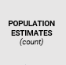]

--

#### Lognormal model with true data
.center[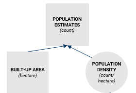]
---

## Tutorial 2: How to model large-scale spatial variations?

--

#### Hierarchical model with true data
.center[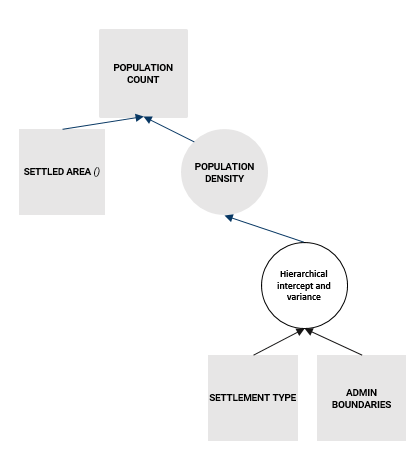]

---

## Tutorial 3: How to model small-scale spatial variations?

--

#### Covariates model with true data

.center[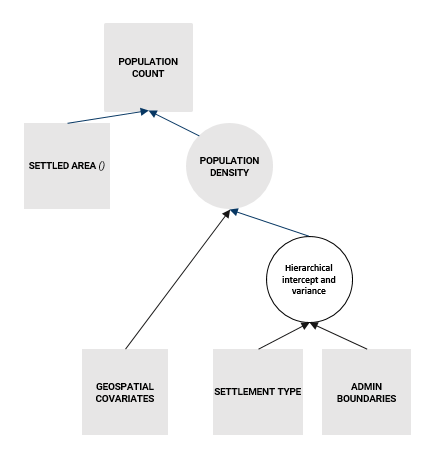]
---
## Tutorial 4: Advanced model diagnostics and prediction

---

# Course material

- All the course presentation and tutorial are provided at this website:
https://wpgp.github.io/bottom-up-tutorial/ 

<br>

--

- The raw code can be found on Github: <br />
https://github.com/wpgp/bottom-up-tutorial

<br>

--

- Workshop workflow:
--

  -   Guided tutorials with live presentation and review
--

  -   Between session: Github issues or e-mail: e.c.darin@soton.ac.uk
