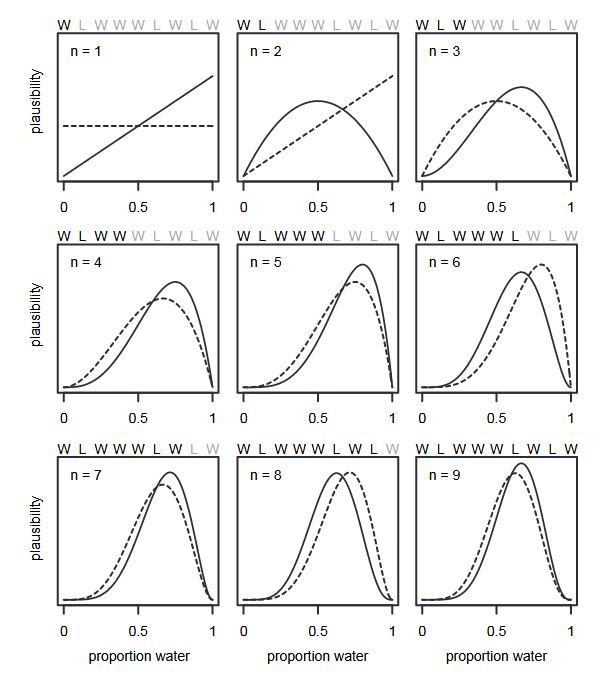
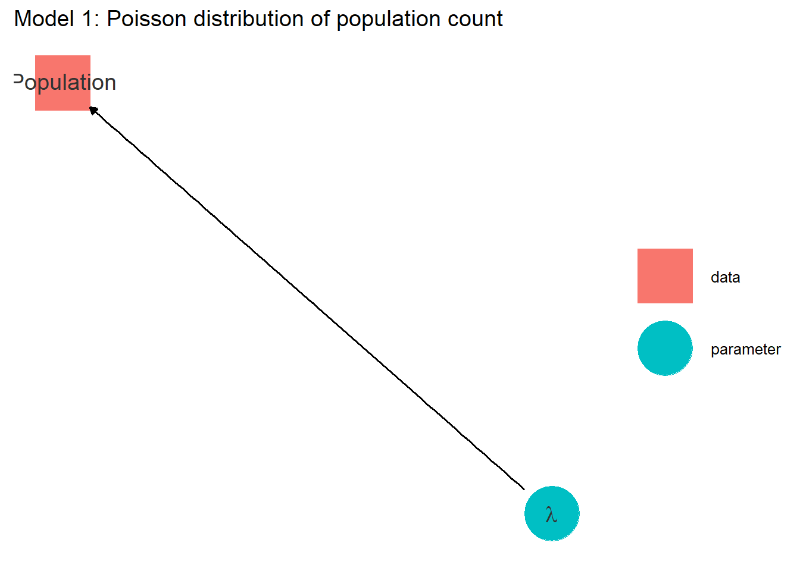
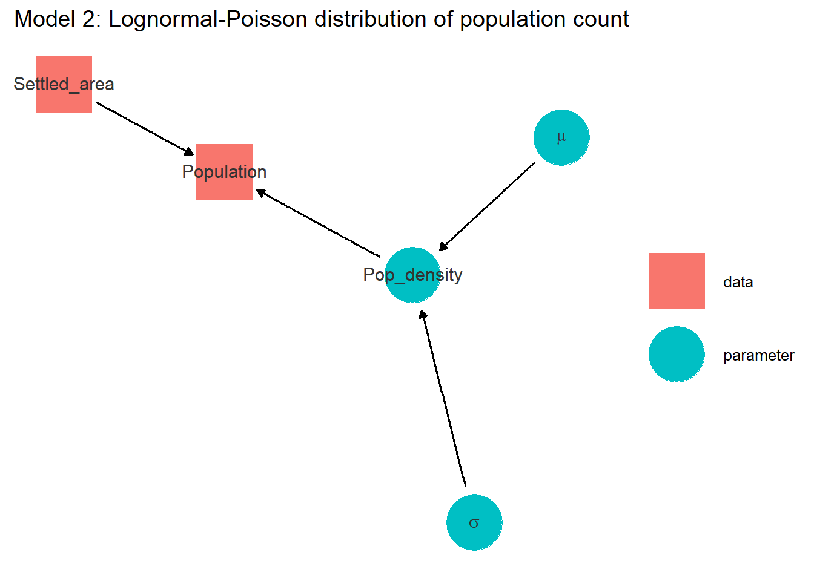
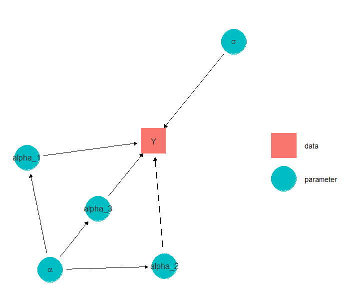
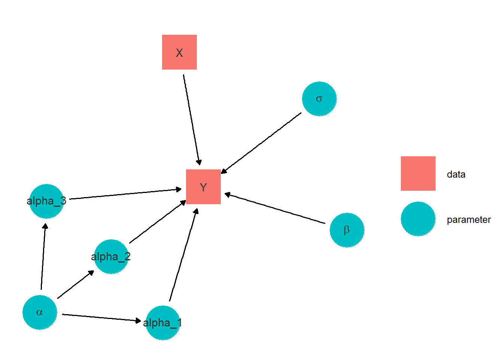
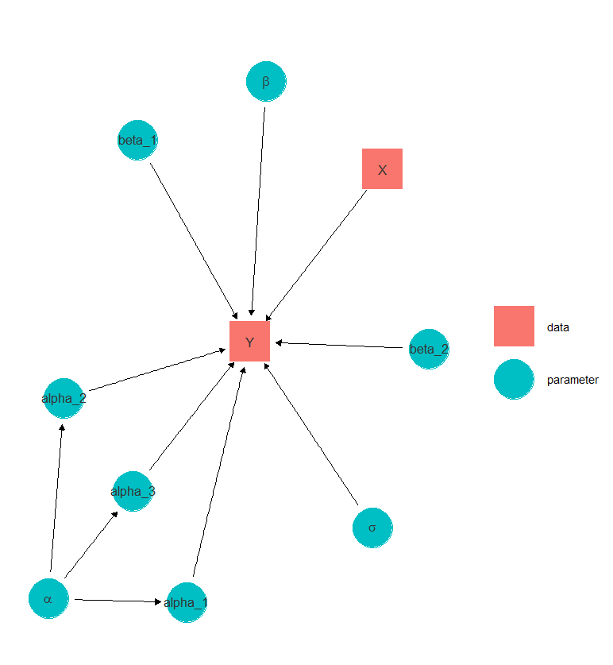
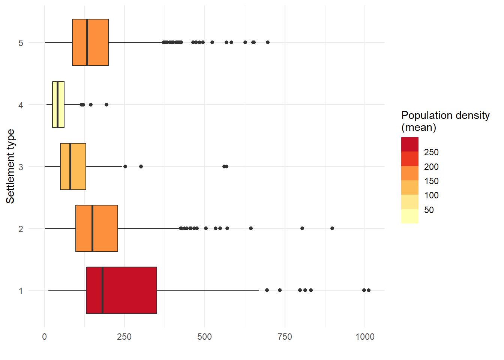
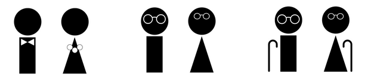

```{r setup, include=FALSE}
options(htmltools.dir.version = FALSE)
library(xaringanthemer)
style_mono_light(base_color = "#ff8000")
xaringanExtra::use_scribble()
xaringanExtra::use_logo(
  image_url = "../assets/pic/320px-UNFPA_logo.svg.png",
  position = xaringanExtra::css_position(bottom = "-3.5em", left = "0.5em")
)
```


# Introduction
---
class: inverse, left, middle

# What have we learned so far?


---
class: center, middle

# Bayesian philosophy

--
#### A story

--
The prior

--
#### Observed data

--
The likelihood

--

#### Updated information
--

The posterior

---

# Example

*Suppose you have a globe representing the planet that you can 
hold in the hand*

.pull-left[
Question: how much of the surface is covered by water?

Experiment:
1. Toss the globe in the air
2. Catch it back
3. Record the nature of the surface under your right finger

Scenario example: WLWWLWWWLWLL
]

.pull-right[

]

.footnote[*Statistical Rethinking, A Bayesian Course with Examples in R and Stan* by Richard McElreath]

---
# Example

.center[
]
.footnote[*Statistical Rethinking, A Bayesian Course with Examples in R and Stan* by Richard McElreath]

---
class: center, middle


# MCMC estimation process

--
### Chains

--

### Initialisation

--

### Warmup

--

### Iterations

---
class: center, middle

# Population model
---


### Population counts are discrete, positive

<br>
.pull-left[

]
.pull-right[
$$population \sim Poisson( \lambda )$$
]

---

### Population counts have overdispersion

<br>
.pull-left[

]
.pull-right[
$$pop \sim Poisson( pop\_density * settled) \\$$
$$pop\_density  \sim Lognormal( \mu, \sigma)$$
]

---

### Population counts varie by region and type

<br>
.pull-left[

]
.pull-right[
$$pop \sim Poisson( pop\_density * settled)$$

$$pop\_density \sim Lognormal( \alpha_{t,r}, \sigma)$$

<br>
$$\alpha_{t,r} \sim Normal(\alpha_t, \nu_t) $$
<br>
$$\alpha_t \sim Normal( \alpha, \nu) \\$$
]


---
### Population counts varie locally

<br>
.pull-left[

]
.pull-right[
$$pop \sim Poisson( pop\_density * settled)$$

$$pop\_density \sim Lognormal( \mu, \sigma)$$
<br>

$$\mu = \alpha_{t,r} + \beta X \\[10pt]$$

<br>
$$\alpha_{t,r} \sim Normal(\alpha_t, \nu_t)$$
<br>
$$\alpha_t \sim Normal( \alpha, \nu)$$
]

---
### Local variations varie by settlement type

<br>
.pull-left[

]
.pull-right[
$$pop \sim Poisson( pop\_density * settled)$$

$$pop\_density \sim Lognormal( \mu, \sigma)$$
<br>

$$\mu = \alpha_{t,r} + \beta_t X \\[10pt]$$

<br>
$$\alpha_{t,r} \sim Normal(\alpha_t, \nu_t)$$
<br>
$$\alpha_t \sim Normal( \alpha, \nu)$$
]


---
class: inverse, left, middle


# What remains to be learned?

---
class: center, middle

# Do your own model!

---

# Practice

1. Defining models
--

2. Defining priors
--

3. Collecting covariates
--

4. Structuring the hierarchy


---
class: center, middle

# Add additional submodels

---
# Modelling

#### Hierarchical structure on the variance term

<br>
.pull-left[]

--


.pull-right[

$$pop \sim Poisson( pop\_density * settled)$$
$$pop\_density  \sim Lognormal( \mu, \sigma_t)$$

]
---
# Modelling


#### Missing households: **Measurement error model** on population count

<br> 
.pull-left[

]

--
.pull-right[$$ N \sim Binomial (pop, \theta) $$
$$pop \sim Poisson( pop\_density * settled)$$
$$pop\_density  \sim Lognormal( \mu, \sigma)$$
<br>

WorldPop.  2020. Bottom-up  gridded  population  estimates  for  Zambia. 
https://dx.doi.org/10.5258/SOTON/WP00662]

--

<br>

Other potential measurement error models: covariates, settlement...
---
# Modelling

#### Complex sampling design: **Weighted likelihood**

$$pop_i \sim Poisson( pop\_density_i * settled_i)$$
$$pop\_density_i  \sim Lognormal( \mu, \tau_i)$$
$$ \tau_i = \frac{w_i}{\sigma}$$

---
# Modelling

#### Age and sex structure

.pull-left[



]
.pull-right[
$$pop \sim Poisson( pop\_density * settled)$$


$$pop\_density  \sim Lognormal( \mu, \sigma)$$

<br>
$$ pop_g \sim Multinomial( pop, \gamma)  $$
$$ \gamma \sim Dirichlet(rep(1,g))$$]

---
class: center, middle

# Gain programming expertise

---
# Programming
 

- Vectorisation

--
- Reparametrisation
