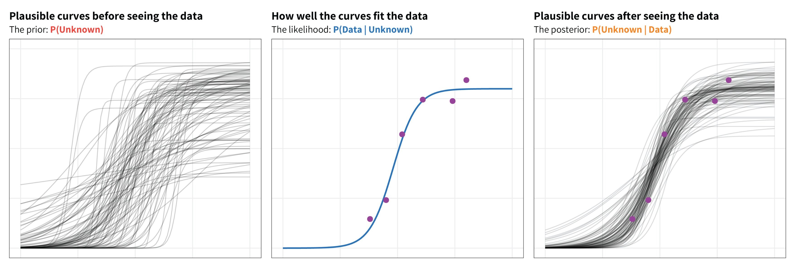
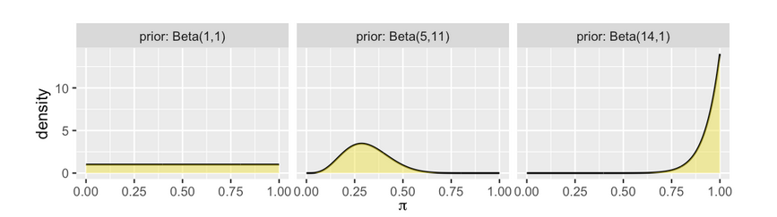
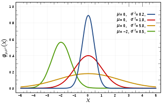
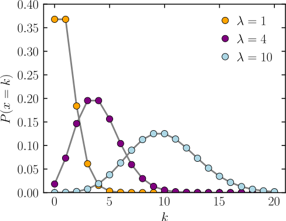
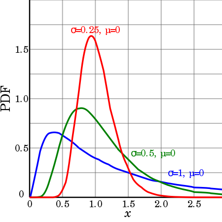
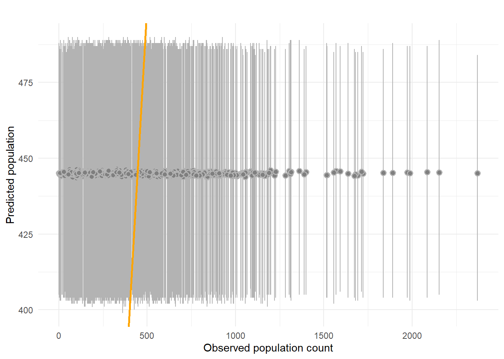
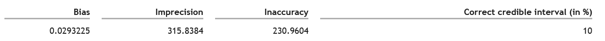

class: inverse, middle, center

```{r setup, include=FALSE}
options(htmltools.dir.version = FALSE)
```

```{r xaringan-themer, include=FALSE, warning=FALSE}
xaringanthemer::style_mono_light(base_color = "#ff8000")
```

```{r xaringanExtra-scribble, echo=FALSE}
xaringanExtra::use_scribble(
  pen_color = "#408000"
)
```

```{r xaringan-logo, echo=FALSE}
xaringanExtra::use_logo(
  image_url = "../../../assets/pic/320px-UNFPA_logo.svg.png",
  position = xaringanExtra::css_position(bottom = "-3.5em", left = "0.5em")
)
```

# Quiz


---
# Bayesian concepts


---
# Bayesian concepts

$$ \text{posterior} \quad = \quad \frac{\text{prior } \cdot \text{ likelihood}}{\text{normalizing constant}} \; $$
--
<br>
.center[]

.footnote[https://twitter.com/andrewheiss/status/1441857561297260548/photo/1
https://www.tjmahr.com/bayes-theorem-in-three-panels/]
---
# Bayesian concepts

.center2[Priors represent the contextual knowledge around a phenomenon (eg, from past experience)
1. TRUE
2. FALSE]
---
# Bayesian concepts

.center2[Priors are derived from the data
1. TRUE
2. FALSE]


---
# Bayesian concepts

.center2[*The **Bechdel test** measures the representation of women in film. It is based on three criteria
and films either pass the test or fail. *

Let π, a random value between 0 and 1, 
denote the unknown proportion of movies that pass the Bechdel test. ]

---
# Bayesian concepts

.center2[Three friends – the **feminist**, the **clueless**, and the **optimist** – have some prior ideas about π. 

<br>

]


.footnote[https://www.bayesrulesbook.com/chapter-4.html#fig:ch4-bechdel-priors]

---
.pull-left[
#### Distribution 1

#### Distribution 2
]
.pull-right[
#### Distribution 3
]

---
# Bayesian estimation

.center2[What does the parameter `warmup` control in stan?
1. the number of iterations
2. the length of the chain
3. the number of iterations post-tuning
4. the length of the chain pre-tuning]

---
# Bayesian estimation

.pull-left[
]

.pull-right[
This is a **traceplot**.

*NB: we can see that the model run for 750 iterations.*

Can we consider that the model converged?
1. Yes
2. No
]

---
# Writing Stan model

```{stan output.var="simpleCode", eval=F, purl=F }
// Stan code
data {
}
parameters {

}
model {
}
```
<br>
.center[
If I want to **modify priors**, which block shall I modify?

1.data block <br/>
2.parameter block <br/>
3.model block
]


---
# Model evaluation

*Let's consider a population model with full convergence of the estimates.*

*We evaluate it by comparing the predicted population counts versus 
the observed population counts*



---
# Model evaluation

*Let's consider a population model with full convergence of the estimates.*

*We evaluate it by comparing the predicted population counts versus 
the observed population counts and we obtain the following goodness-of-fit metrics*

<br>



<br>
.center[
Can we be confident about the model results? <br/>
1.Yes <br/>
2.No
]


