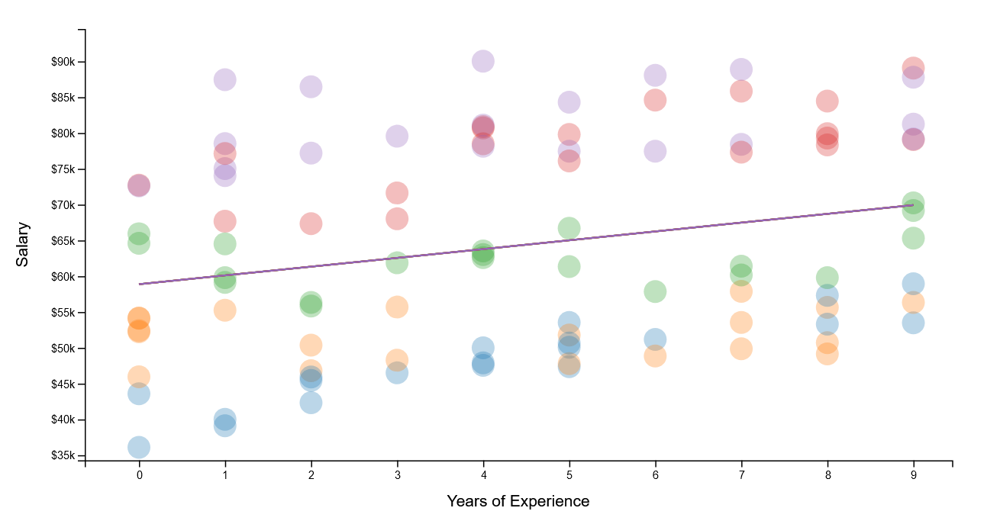
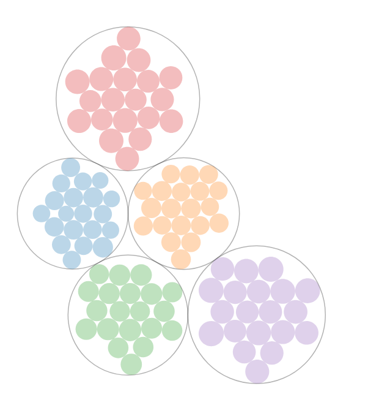
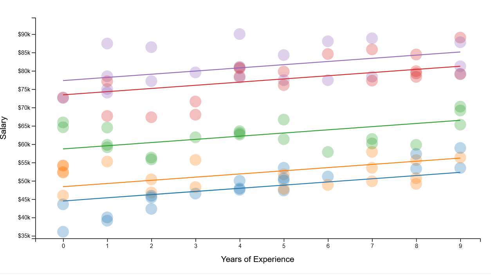
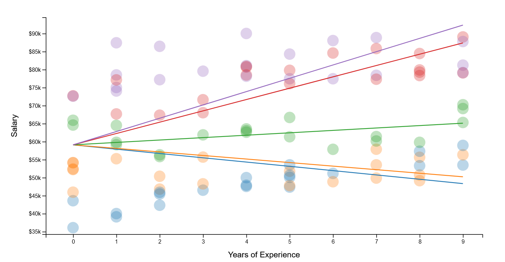
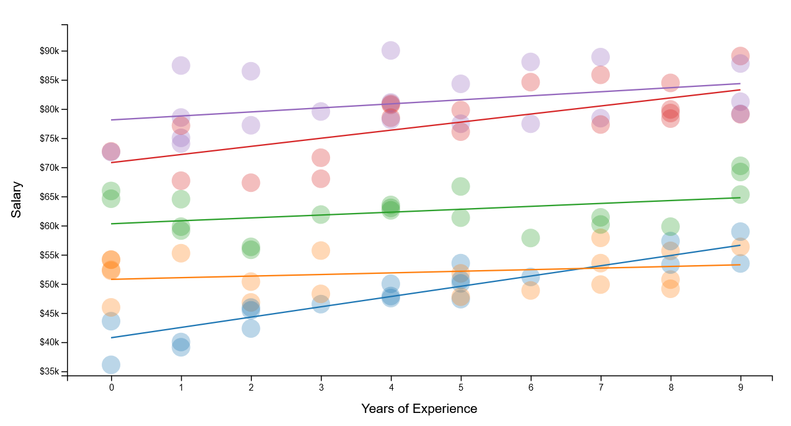

class: inverse, middle, center

```{r setup, include=FALSE}
options(htmltools.dir.version = FALSE)
```

```{r xaringan-themer, include=FALSE, warning=FALSE}
xaringanthemer::style_mono_light(base_color = "#ff8000")
```

```{r xaringanExtra-scribble, echo=FALSE}
xaringanExtra::use_scribble(
  pen_color = "#408000"
)
```

```{r xaringan-logo, echo=FALSE}
xaringanExtra::use_logo(
  image_url = "../../../assets/pic/320px-UNFPA_logo.svg.png",
  position = xaringanExtra::css_position(bottom = "-3.5em", left = "0.5em")
)
```

# Quiz

---

# Writing Stan model
```{stan output.var="simpleCode", eval=F, purl=F }
// Stan code
data{}
transformed parameters{}
parameters{}
model{}
generated quantities{}
```
<br>
.center[
If I want to include **predictions** in the `stan` estimation, which block shall I 
use?

1.data  <br/>
2.parameter  <br/>
3.transformed parameter  <br/>
4.model  <br/>
5.generated quantities 
]


---
# Population model

$$population \sim Poisson( pop\_density * settled\_area)$$

$$pop\_density  \sim Lognormal( \mu, \sigma)$$
$$\mu = \alpha_{t,r} + \beta X$$
--
<br>
.center[If we have selected six covariates, how many beta priors do we need?

1.0 <br/>
2.1<br/>
3.6]

---
layout: true
# Stan model

```{stan output.var="simpleCode", eval=F }
for(i in 1:n){
  mu[i] = alpha_t_r[type[i], region[i]] + sum(cov[i,] .* beta);
}
```
---
.center2[What is the size of `type[i]`
1. 0
2. 1
3. Number of settlement type
4. Number of observations
]
---
.center2[What is the size of `alpha_t_r`
1. Number of settlement type
2. Number of region
3. Number of settlement type x Number of region
4. (Number of settlement type, Number of region)
]
---

.center2[What is the size of `cov[i,]`
1. 0
2. 1
3. Number of covariates
4. (Number of observations , Number of covariates)
]
---

.center2[What is the size of `beta`
1. 0
2. 1
3. Number of covariates
4. (Number of observations , Number of covariates)
]
---
layout: true
# Random model
.footnote[From Michael Freeman, http://mfviz.com/hierarchical-models/]
---

Estimate faculty salaries based on years of experience:

--
.center[
]
--

$$ salary = \alpha + \beta * experience$$

---
Estimating faculty salaries, where the faculty work in different departments

.center[
]

---
Each faculty has a different starting salary

--

.pull-left[


]

--
.pull-right[
Is the data represented under:
1. Complete-pooling assumption
2. No-pooling assumption
3. Partial-pooling assumption
]


---
Each faculty has a different starting salary

.pull-left[


]

.pull-right[
Is it a:
1. Hierarchical model 
2. Random intercept model
3. Random slope model
]

--

$$ salary = \alpha_f + \beta * experience$$
---
Faculty salaries increase at different rates depending on the department

--

.pull-left[


]

--
.pull-right[
Is it a:
1. Hierarchical model 
2. Random intercept model
3. Random slope model
]

--

$$ salary = \alpha + \beta_f * experience$$

---
.center[
]

$$ salary = \alpha_f + \beta_f * experience$$


