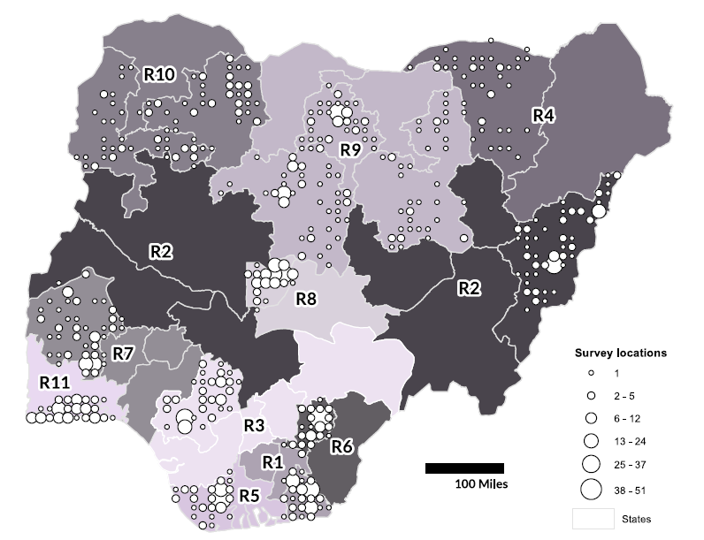

```{r logo, echo=FALSE, purl=F}
###LOAD WP LOGO##
htmltools::img(src = knitr::image_uri("../../assets/pic/320px-UNFPA_logo.svg.png"),
               alt = 'logo', style = 'position:absolute; top:60px; right:0; padding:20px; width: 25%; height: auto')
```


```{r, include=F}
# 1 Set-up ----

# load libraries
library(tidyverse) # managing data
library(ggdag) # drawing DAG
library(kableExtra) # visualising table
library(here) # handling path
library(rstan) # running Bayesian models
```

# Introduction

The first part of this tutorial will cover how to revamp a basic frequentist model into a Bayesian model and will introduce some concepts such as Directed Acyclic Graph (DAG) and priors.

The second part will be devoted to presenting the dataset we will be working with for the next three tutorials.

We will present two simple population models:

-   a model based on the Normal distribution

-   a multilevel model based on a Poisson-Lognormal compound.

This will be the occasion to experiment with the Stan software and its R interface `rstan`.

### Goals

1.  Write a simple linear regression in a Bayesian framework

2.  Adapt the statistician toolbox to a real-world example

3.  Fit a Normal model in `stan` for modelling population:

    1.  Format data for `stan`

    2.  Specify a model in the `stan` language

    3.  Set up a MCMC sampler to fit the model

    4.  Evaluate results and limitations

4.  Fit a Poisson-Lognormal model for modelling population

### Supporting readings

This series of tutorials are not an introduction to statistics. For this specific lesson, it would be good to be familiar some statistical concepts, and for that purpose we indicate useful resources:

-   Probabilistic distribution

    -   [Linear regression](https://en.wikipedia.org/wiki/Linear_regression)

    -   [Normal distribution](https://en.wikipedia.org/wiki/Normal_distribution), [Poisson distribution](https://en.wikipedia.org/wiki/Poisson_distribution), [Log-normal distribution](https://en.wikipedia.org/wiki/Log-normal_distribution)

-   Markov chain Monte Carlo (MCMC), a simulation-based method for model estimation:

    -   [Markov chains explained visually](https://setosa.io/ev/markov-chains/) by Victor Powell
    -   [Metropolis-Hastings Monte Carlo](https://www.bayesrulesbook.com/chapter-7.html), a specific case of MCMC that is used in `stan`. This chapter comes from the *Bayes Rules!* online book by Alicia A. Johnson, Miles Ott and Mine Dogucu

-   [Prior probability](https://en.wikipedia.org/wiki/Prior_probability)

And we add to that list the documentation for the software used:

-   Software: [Stan](https://mc-stan.org/users/documentation/)

    *Stan is a C++ library for Bayesian modeling and inference that primarily uses the No-U-Turn sampler (NUTS) @homan to obtain posterior simulations given a user-specified model and data*

-   Interface: [rstan](https://mc-stan.org/rstan/articles/rstan.html)

    *The rstan package allows one to conveniently fit Stan models from R (R Core Team 2014) and access the output, including posterior inferences and intermediate quantities such as evaluations of the log posterior density and its gradients.*

# From a frequentist to a Bayesian mindset

In a standard frequentist approach, a linear regression between $Y$ the response variable and $X$ the predictors can be formulated as:

```{=tex}
\begin{equation}

Y = \alpha  + \beta X + \epsilon \\
\epsilon \sim Normal(mean=0,sd=\sigma)(\#eq:linear)
\end{equation}
```
Equation \@ref(eq:linear) can be rewritten as: $$Y \sim Normal(mean=\mu, sd=\sigma)$$ $$ \mu=\alpha + \beta X$$

This format is more flexible when we start working with **non-normal error structures** and **custom modelling components**.

This linear regression can be represented using a directed acyclic graph (DAG) that helps to picture the relationships between model parameters and input data:

```{r, echo=F}
# draw linear model DAG
dagify(
    Y ~ mu,
    Y ~ sigma,
    mu ~ alpha,
    mu ~ beta,
    mu ~ X,
    outcome = 'Y'
  ) %>%
    tidy_dagitty(seed=11) %>% 
    mutate(color=c('data','parameter',  'parameter','parameter',  'parameter','data')) %>% 
    ggplot(aes(x = x, y = y, xend = xend, yend = yend, color=color,shape=color)) +
    geom_dag_point() +
    geom_dag_edges() +
    geom_dag_text(col = "grey20",size=6,  parse=T) +
    scale_shape_manual(values=c(15,19))+
    theme_dag()+ labs(title = 'Graph of a linear regression', color='', shape='')
```

In a DAG, Squares represent data and circles represent parameters. Directions of arrows indicate dependence.

In a Bayesian model, all root node parameters (those with no arrows pointing towards them) need **priors** to be specified: $$ \alpha \sim Normal(mean=0, sd=1000)$$ $$ \beta \sim Normal(mean=0, sd=1000)$$ $$ \sigma \sim Uniform(min=0, max=1000)$$

These are examples of **weakly informative priors**, because the variances are large relative to the data. Weakly informative priors should not have any noticeable influence on the final parameter estimates.

## How to choose priors

To identify a distribution to use for priors, ask yourself:

1.   "What values are possible for this parameter?" and

2.  "How certain am I about it?".

In most of Bayesian analyses, we generally know what our data do and do not look like such that we can build priors that reflect the properties of potential datasets. Defining such priors consists of **indicating what is the likely range of values for our parameters** and downweighting out-of-range values. Furthermore if we are uncertain about the range we can increase the variability of the priors (through their scale/variance parameter), because we don't want the priors to influence too much the posteriors.

**Regression coefficients** are generally continuous numbers that can take values from -∞ to +∞. The normal distribution is a good choice of prior for these parameters because it has the same characteristics.

**Standard deviations** are continuous numbers that must be positive. A normal distribution is not a good choice for this prior because it includes negative numbers. The simplest is a uniform(0,*a*) with *a* defining the upper bound on likely values. In reality this is not perfect as it enforces a hard constraint. Other distributions can be considered as a half-Normal or a half-Cauchy distribution.

The bayesrules book has a very good [chapter](https://www.bayesrulesbook.com/chapter-4.html#) on the interaction between priors and data.

The `stan` team put together interesting [guidelines](https://github.com/stan-dev/stan/wiki/Prior-Choice-Recommendations) to prior setting.

## Let's try with simulated data

### Setting up

First, download the most recent versions of the following softwares:

-   R (<https://www.r-project.org/>)

-   RStudio (<https://rstudio.com/products/rstudio/download/>)

Next, install and set up the **`rstan`** package by carefully following the [directions](https://github.com/stan-dev/rstan/wiki/RStan-Getting-Started).

```{r}
# stan setup
options(mc.cores = parallel::detectCores()) #set up the maximum number of cores used by stan
rstan::rstan_options(auto_write = TRUE) # speed up running time 
```

-   Install a set of data wrangling packages:

```{r, eval=F}
install.packages(c( "tidyverse", # for data manipulation
                    'kableExtra', # for good visualisation of tables
                    'here' # for handling relative path to external assets (pic, data)
                    ), 
                 dependencies = TRUE)
```

For more information, check out their vignettes: [tidyverse](https://www.tidyverse.org/), [kableExtra](http://haozhu233.github.io/kableExtra/) and [here](https://cran.r-project.org/web/packages/here/vignettes/here.html).

### Simulating data

We will simulate **fake observations** to introduce the basic concepts of Bayesian modelling and their implementation in `stan`.

We produce our fake data as 1000 draws of a Normal distribution with mean 5 and standard deviation 50:

```{r}
# 2 Simulated data ----

# Simulate data
seed <- 2004
set.seed(seed)
data <- tibble(y=rnorm(1e3, mean= 5, sd=50))
```

Note that we define a `seed` for the results to be exactly replicated.

The observed distribution of our simulated data is the following:

```{r sim-distrib,class.source = 'fold-hide', fig.cap='Simulated observations distribution'}
# plot simulated data
ggplot(data, aes(x=y))+
  geom_histogram(bins = 50)+
  theme_minimal()+
  geom_vline(xintercept = mean(data$y), color='orange', size=1)+
  annotate('text', x=15, y=30, label=paste0('Observed mean: ', round(mean(data$y),2)), colour='orange', angle=90)+
  geom_segment(x=0,y=1, xend=sd(data$y), yend=1, colour='orange', size=1)+
  annotate('text', x=50, y=4, label=paste0('Observed sd: ', round(sd(data$y),2)), colour='orange')+
  labs(y='', x='observed y')+
  theme(axis.text.y = element_blank())
```

### Modelling the data

Now we want to model $y$, our observations. We see that $y$ has a clear bell shape. It can thus be **approximated with a Normal distribution** that is: $$Y \sim Normal(mean=\mu, sd=\sigma)$$

The corresponding DAG is:

```{r, class.source = 'fold-hide',}
# Normal model DAG
dagify(
  Y ~ alpha,
  Y ~ sigma) %>%
  tidy_dagitty(seed=41) %>% 
  mutate(color=c('parameter', 'parameter','data')) %>% 
  ggplot(aes(x = x, y = y, xend = xend, yend = yend, color=color,shape=color)) +
  geom_dag_point() +
  geom_dag_edges() +
  geom_dag_text(col = "grey20",size=6,  parse=T) +
  scale_shape_manual(values=c(15,19))+
  theme_dag()+ labs(title = 'Model with simulated data: Normal distribution of Y', color='', shape='')
```

**We need to give some prior to the two parameters** $\mu$ the mean and $\sigma$ the standard deviation. Let's imagine that we don't have access to more information on the variable $Y$ than its manifestation in our dataset.

We can guess that $\mu$ is around zero but without great confidence (see Figure \@ref(fig:sim-distrib)). In other words, we can assume that $\mu$ can be drawn from a Normal(0,100).

```{r prior-mu-distrib,class.source = 'fold-hide', fig.cap='Mu prior distribution'}

# define mu prior
data$prior_mu <- rnorm(1e3, mean= 0, sd=100)

ggplot(data)+
  geom_histogram(aes(x=y, after_stat(density)), bins=50, fill='grey30')+
  geom_density(aes(x=prior_mu), colour='#00BFC4', size=1)+
  theme_minimal()+
  annotate('text', y=0.0020, x=250, label=paste0('Normal(0,100)'), colour='#00BFC4', size=5)+
    theme(axis.text.y = element_blank())+
  labs(y='', x='observed y')
```

Figure \@ref(fig:prior-mu-distrib) shows what our prior for $\mu$ means: we think that $\mu$ is likely to be around zero but could be up to 200. Given that our observed $y$, $\hat{y}$, has no occurrences above 200, it is unlikely that the mean of $y$ is 200 but we don't exclude the possibilty. However we do consider that 0 is more likely than 200.

For $\sigma$, we have stricter expectations. Indeed standard deviations are positive. We thus choose as prior for $\sigma$ a Uniform(0, 200).

```{r prior-sigma-distrib,class.source = 'fold-hide', fig.cap='Sigma prior distribution'}
# define sigma prior
data$prior_sigma <- runif(1e3,min = 0, max = 200)

ggplot(data)+
  geom_histogram(aes(x=y, after_stat(density)), bins=50, fill='grey30')+
  geom_density(aes(x=prior_sigma), colour='#00BFC4', size=1, trim=T)+
  theme_minimal()+
  annotate('text', y=0.0060, x=150, label=paste0('Uniform(0,200)'), colour='#00BFC4', size=5)+
      theme(axis.text.y = element_blank())+
  labs(y='', x='observed y')
```

Figure \@ref(fig:prior-sigma-distrib) shows that a uniform prior means a equal probability of $\sigma$ to be 0 as to be 200.

**The final model is**:

```{=tex}
\begin{equation}

Y \sim Normal( \mu, \sigma ) \\[1pt]
\\
\mu \sim Normal( 0, 100 ) \\
\sigma \sim Uniform( 0, 200 )(\#eq:modeltheo)

\end{equation}
```
### Implementing the model in `stan`

To estimate $\mu$ and $\sigma$, we will write **our first model** in stan.

```{stan output.var="simpleCode", eval=F, purl=F }
// Model for simulated data: y as normal distribution
data {
  int<lower=0> n; // number of observations
  vector[n] y; // observations
}

// The parameters accepted by the model. Our model
// accepts two parameters 'mu' and 'sigma'.
parameters {
  real mu;
  real<lower=0> sigma;
}

// The model to be estimated. We model the output
// 'y' to be normally distributed with mean 'mu'
// and standard deviation 'sigma'.
model {
  y ~ normal(mu, sigma);
  
  mu ~ normal(0,100);
  sigma ~ uniform(0,200);
}
```

A `stan` model is composed of code blocks. The fundamental ones are:

-   the **data block** that describes the input data to the model

-   the **parameters block** that describes the parameters to be estimated

-   the **model block** that describes the stochastic elements: (1) the interaction between the parameters and the data, (2) the prior distribution

The `stan` software requires us to declare all variables, both parameters and data, with their type (int, real) and size (as indicated with `[n]`)[^1] . It is possible to incorporate constraints on the variable support, e.g. it is not possible to have a negative $\sigma$ (`real<lower=0> sigma`).

[^1]: More details [here](https://mc-stan.org/docs/2_27/reference-manual/overview-of-data-types.html).

Note: `stan` requires to leave one blank line at the end of the script.

We will store the model in a `stan` file called `tutorial1_model.stan` in the `tutorial1` folder.

### Preparing the data for stan

Stan software takes as input a list of the observed data that defines the variables indicated on the `data block`.

```{r}
# prepare data for stan
stan_data <- list(
  y = data$y,
  n = nrow(data))
```

### Running the model

We set up the **parameters of the Markov Chain algorithm.**

```{r}
# mcmc settings
chains <- 4
warmup <- 250
iter <- 500
```

The `chains` argument specified the number of Markov chains to run simultaneously. We want the Markov chains to replicate a fully random process. However, the design of the chain algorithm makes every sample dependant on the previous sample. To recreate a random setting we run independently several chains to explore the parameter space and that *hopefully* converge to the same consistent solution.

The `warmup` parameter is the number of samples at the beginning of the estimation process that we discard from the results. This is similar to cooking pancakes in the sense that you need the algorithm to warm up before nearing reasonable values.

The `iter` parameter specifies the number of iterations, that is the length of the Markov chain. The longer the chain the more likely it is to stabilize around the correct estimate.

Then we define the **parameters that we want to monitor,** which are stored during the estimation process:

```{r}
# parameters to monitor
pars <- c('mu','sigma')
```

And we are ready to **run the model**!

```{r}
# mcmc
fit <- rstan::stan(file = file.path('tutorial1_model.stan'), 
                   data = stan_data,
                   iter = warmup + iter, 
                   chains = chains,
                   warmup = warmup, 
                   pars = pars,
                   seed = seed)
```

### Checking the MCMC simulations

We check the Markov chains to see if they converged to a unique solution. It can be visualized with a **traceplot** for the two parameters, $\mu$ and $\sigma$. A traceplot describes the evolution of the parameter estimation across the Markov chain iterations. A good traceplot sees the mixing of the different chains, evidence of convergence to a single estimate.

```{r model-trace, fig.cap='Model Traceplot'}
# plot trace
stan_trace(fit, inc_warmup = T)
```

Figure \@ref(fig:model-trace) shows both the warm-up period (up until 250) and the following iterations. We see that convergence happened before the end of the warm-up period and is stable over the iterations, because the four chains mixed well.

From Figure \@ref(fig:model-trace) (and the absence of warning from `stan` ), we can conclude that the model converged.

### Evaluating the estimated parameters

Bayesian statistics consider parameters as stochastic, thus it estimates a distribution for each parameter. In practice `stan` stores parameters estimates for each iteration post-warmup for each chain which gives us 500x4 estimates of the *posterior distribution*.

We can extract from the `stanfit` object a summary of the estimated distribution using the `summary` function:

```{r}
# summarise estimated parameters
estimated <- summary(fit, pars=pars)$summary

estimated %>% kbl() %>% kable_minimal()
```

We can then compare **the parameters** $\hat\mu$ **and** $\hat\sigma$ with the observed average and standard deviation of $\hat{y}$ as well as the true value, using the `stan_plot` function.

```{r,class.source = 'fold-hide', warning=F, message=F}
# plot estimated parameters
mean_pop <- mean(data$y)
sd_pop <- sd(data$y)


alpha_plot <- stan_plot(fit, 'mu',fill_color='orange')+
  annotate('segment',x=mean_pop, xend=mean_pop, 
           y=0.7, yend=1.2,col='grey40', size=1)+
  annotate('text',x=mean_pop, 
           y=1.5, col='grey40',label= paste0('Observed\n',round(mean_pop,2)), fontface =2, size=4.5)+
    annotate('segment',x=5, xend=5, 
           y=0.7, yend=1.2,col='grey10', size=1)+
    annotate('text',x=5, 
           y=1.5, col='grey10',label= paste0('True\n',5), fontface =2, size=4.5)+
    annotate('text',x=estimated['mu', 'mean'], 
           y=1.5, col='orange',label= paste0('Estimated\n',round(estimated['mu', 'mean'],2)), fontface =2, size=4.5)
sigma_plot <- stan_plot(fit, 'sigma', fill_color='orange')+
  annotate('segment',x=sd_pop, xend=sd_pop, 
           y=0.7, yend=1.2,col='grey40', size=1)+
  annotate('text',x=sd_pop, 
           y=1.5, col='grey40',
           label= paste0('Observed\n', round(sd_pop,2)), fontface =2, size=4.5)+
    annotate('segment',x=50, xend=50, 
           y=0.7, yend=1.2,col='grey10', size=1)+
    annotate('text',x=50, 
           y=1.5, col='grey10',label= paste0('True\n',50), fontface =2, size=4.5)+
    annotate('text',x=estimated['sigma', 'mean'], 
           y=1.5, col='orange',label= paste0('Estimated\n',round(estimated['sigma', 'mean'],2)), fontface =2, size=4.5)

gridExtra::grid.arrange(alpha_plot, sigma_plot, nrow=2)

```

We see that (1) the observed mean and standard deviation are within the 95% credible intervals of the estimated parameters, (2) the true mean and standard deviation are within the 95% credible intervals of the estimated parameters,

The model structure is inline with the observed data and manages to approximate the true data generating process.

# Let's try with real data

Let's download the data we will be modelling. It belongs to the [supplementary material](https://www.pnas.org/content/suppl/2020/09/09/1913050117.DCSupplemental) of the seminal paper describing WorldPop bottom-up population models [@leasure2020].

```{r, include=F}
# 3 Introduce the data ----

```

```{r, eval=F}

# download  tutorial data
download.file(
  "https://www.pnas.org/highwire/filestream/949050/field_highwire_adjunct_files/1/pnas.1913050117.sd01.xls",
  'tutorials/data/nga_demo_data.xls',
  method='libcurl',
  mode='wb'
)
```

## The data

The data consists of household surveys that collected information on the total population in 1141 clusters in 15 of 37 states in Nigeria during 2016 and 2017. Clusters varied slightly in size, but were all approximately 3 hectares. These clusters were randomly sampled locations whose boundaries were drawn based on high resolution satellite imagery. The surveys are further described in @leasure2020 and @weber2018. Survey site locations are shown in Figure \@ref(fig:ngamap).

```{r ngamap, echo = FALSE, fig.cap = "Microcensus surveys mapped as the number of survey locations within a 20km grid cell. Region groupings are shaded and numbered R1 - R11. Source: Leasure et al. (2020).", fig.align='center'}
# map sample locations

```

The map in Figure \@ref(fig:ngamap) shows some key characteristics of the stratified-random sample design:

-   Only some states were sampled

-   But at least 1 state per "region" was sampled

-   Within states, locations were randomly sampled within settlement types

Let's look at the table attributes:

```{r,class.source = 'fold-hide'}
#load data
data <- readxl::read_excel(here('tutorials/data/nga_demo_data.xls'))
# create unique cluster id
data <- data %>% 
  mutate(
    id= paste0('cluster_',(1:n())), # compute cluster id
    pop_density = N/A # compute population density
  )
data %>% select(id,N, A) %>% head(10) %>% kbl() %>% kable_minimal()
```

Each row is a survey site, with population counts (`N`) and the settled area (`A`) in hectares.

### Response variable: the population count

We want to model the **distribution of population count** at each survey site:

```{r pop-distrib,class.source = 'fold-hide', fig.cap='Observed population count distribution at survey sites'}
# plot population count
ggplot(data, aes(x=N))+
  geom_histogram(bins=50)+
  theme_minimal()+
  theme(axis.text.y = element_blank())+
  labs(title = "", y='', x='Observed population count')+
  geom_vline(xintercept = mean(data$N), color='orange', size=1)+
  annotate('text', x=500, y=25, label=paste0('Observed mean: ', round(mean(data$N))), colour='orange', angle=90)

```

Note the wide variation in population count per survey site, with a maximum of `r max(data$N)` people.

## Modelling Population count: a Poisson distribution

Population count is by definition a discrete, positive variable. A good distribution candidate is the Poisson distribution.

$$
population \sim Poisson( \lambda )
$$

The corresponding DAG shows the interaction between the population count and the model parameter:

```{r, echo=F}
# 4 Model1: Poisson distribution ----

# Normal model DAG
dagify(
  Population ~ lambda,
  outcome = 'Population'
  ) %>%
  tidy_dagitty(seed=9) %>% 
  mutate(color=c('parameter',  'data')) %>% 
  ggplot(aes(x = x, y = y, xend = xend, yend = yend, color=color,shape=color)) +
  geom_dag_point() +
  geom_dag_edges() +
  geom_dag_text(col = "grey20",size=5,  parse=T) +
  scale_shape_manual(values=c(15,19))+
  theme_dag()+ labs(title = 'Model 1: Poisson distribution of population count', color='', shape='')
```

We then have to define the prior for $\lambda$, which corresponds to the mean of the Poisson distribution. We will choose relatively uninformed priors based on our understanding of the data.

We know that the mean observed population count is around 450 per cluster. We set up the prior for $\lambda$ to follow a Uniform between 0 and 3000 to ensure a positive parameter while reducing the information given to the estimation process, and thus the bias introduced.

```{r prior-lambda-distrib,class.source = 'fold-hide', fig.cap='Lambda prior distribution'}
# define lambda prior
data$prior_lambda <- runif(nrow(data), min=0, max=3000)

ggplot(data)+
  geom_histogram(aes(x=N, after_stat(density)), bins=50, fill='grey30')+
  geom_density(aes(x=prior_lambda), colour='#00BFC4', size=1)+
  theme_minimal()+
  annotate('text', y=0.0005, x=2000, label=paste0('Uniform(0,3000)'), colour='#00BFC4', size=5)+
    theme(axis.text.y = element_blank())+
  labs(y='', x='Observed population count')
```

The final model is:

```{=tex}
\begin{equation}

population \sim Poisson( \lambda ) \\
\\
\lambda \sim Uniform( 0, 3000 )(\#eq:model1)

\end{equation}
```
### Implementing the model

To estimate $\lambda$, we will write **our first population model** in stan.

```{stan output.var="simpleCode", eval=F, purl=F }
// Model 1: Population count as a Poisson distribution 
data{
  int<lower=0> n; // number of microcensus clusters
  int<lower=0> population[n]; // count of people
}
parameters{
  // rate
  real<lower=0> lambda; 
}

model{
  // population totals
  population ~ poisson(lambda);
  // rate
  lambda ~ uniform(0, 3000);
}
```

We declare the input variable `population` as integer because our population data are counts and set it up to be positive. We define $\lambda$ as a positive real.

We store this model under `tutorial1_model1.stan`.

### Estimating the model

We prepare the data for `stan`:

```{r}
# prepare data for stan
stan_data <- list(
  population = data$N,
  n = nrow(data))
```

We keep the same parameters as previously for the Markov Chain algorithm and declare $\lambda$ as the parameter to monitor

```{r}
# parameters to monitor
pars <- c('lambda')
```

And we are ready to **run the model**!

```{r}
# mcmc
fit <- rstan::stan(file = file.path('tutorial1_model1.stan'), 
                   data = stan_data,
                   iter = warmup + iter, 
                   chains = chains,
                   warmup = warmup, 
                   pars = pars,
                   seed = seed)
```

The traceplot shows a model that converges to the observed mean:

```{r}
traceplot(fit, inc_warmup=T)
```

Note the wide variation at the start of the estimation. This is due to the uniform prior for $\lambda$ declaring that any value between 0 and 3000 is similarly possible.

## Evaluating the model goodness-of-fit

### Estimated parameters

We plot **the estimated parameter** $\hat\lambda$ to see how it compares with the observed average population count.

```{r,class.source = 'fold-hide', warning=F, message=F}
# plot estimated parameters
mean_pop <- mean(data$N)

stan_plot(fit, 'lambda',fill_color='orange')+
  annotate('segment',x=mean_pop, xend=mean_pop, 
           y=0.7, yend=1.2,col='grey40', size=1)+
  annotate('text',x=mean_pop, 
           y=1.5, col='grey40',label= paste0('Observed average\n',round(mean_pop,2)), fontface =2, size=4.5)


```

The estimated mean corresponds to the observed mean.

### Predicted population count

To see if the model is coherent with the observations, we can compute the predicted population count for every survey site. It is part of posterior predictive checking which is based on the following idea: *if a model is a good fit then we should be able to use it to generate data that looks a lot like the data we observed*.

It is possible in `stan` to do it as part of the estimation process through the **generated quantities block** .

```{stan output.var="simpleCode", eval=F, purl=F }
// Model 2bis: Population count as a normal distribution with integrated predictions
...
generated quantities{
   real population_hat[n];

   for(idx in 1:n){
     population_hat[idx] = poisson_rng( lambda );
   }
}
```

We define the parameter `population_hat` as a draw (as represented by the suffix `rng` for *random number generator*) from a Poisson distribution with the estimated $\hat\lambda$ for each iteration.

We run the model stored under `tutorial1_model1bis.stan`:

```{r}
pars <- c('lambda', 'population_hat')

# mcmc
fit_model1 <- rstan::stan(file = file.path('tutorial1_model1bis.stan'), 
                   data = stan_data,
                   iter = warmup + iter, 
                   chains = chains,
                   warmup = warmup, 
                   pars = pars,
                   seed = seed)
```

And extract the predicted population count.

```{r, warning=F}
# extract predictions
predicted_pop_model1 <- as_tibble(extract(fit_model1, 'population_hat')$population_hat)

colnames(predicted_pop_model1) <- data$id
```

We obtain a table with 500 predictions \* 4 chains for each survey site.

```{r, class.source = 'fold-hide'}
predicted_pop_model1 %>% 
  mutate(iteration= paste0('iter_', 1:(iter*chains))) %>% 
  select(iteration, 1:10) %>% head(10) %>% kbl() %>% kable_minimal()
```

We get thus a **posterior prediction distribution of population count** for every survey site. Figure \@ref(fig:posterior-ex) shows a posterior distribution for the first survey site.

```{r posterior-ex, class.source = 'fold-hide',fig.cap='Example of posterior prediction distribution for one cluster'}
# plot posterior prediction for one cluster
ggplot(predicted_pop_model1, aes(x=cluster_1))+
  geom_density(size=1.5, color='orange')+
  theme_minimal()+
    theme(axis.text.y = element_blank())+
  labs(title = "Population prediction for cluster 1 ", y='', x='')
```

We can extract for every survey site its mean prediction and 95% credible interval.

```{r}
# summarize predictions
comparison_df <- predicted_pop_model1 %>% 
      pivot_longer(everything(),names_to = 'id', values_to = 'predicted') %>% 
      group_by(id) %>% 
      summarise(across(everything(), list(mean=~mean(.), 
                                          upper=~quantile(., probs=0.975), 
                                          lower=~quantile(., probs=0.025))))
comparison_df %>% head() %>% kbl() %>% kable_minimal()
```

We note that all predictions are very similar. The model includes only two parameters --- mean and standard deviation --- and the site-level predictions do not account for any site-level characteristics. Therefore, predictions at each site are drawn from the exact same distribution.

Let's see the global picture by plotting the observed vs the predicted population count. A perfect model would see all points on the 1:1 line.

```{r model1-comp, class.source = 'fold-hide', fig.cap='Comparison between observed and predicted population count (with the Poisson model). Orange line indicates the 1:1 line'}
# add observed values
comparison_df <- comparison_df %>% 
  left_join(data %>% 
              select(id, N), by = 'id')

# plot predicted vs observed
ggplot(comparison_df) +
  geom_pointrange(aes(x=N, y=predicted_mean, ymin=predicted_lower, ymax=predicted_upper
                      ),
                   fill='grey50', color='grey70', shape=21
                  )+
  geom_abline(slope=1, intercept = 0, color='orange', size=1)+
  theme_minimal()+
  labs(title = '', x='Observed population count', y='Predicted population')
```

Figure \@ref(fig:model1-comp) is a great visualization of the prediction process. Since the model has no covariates (introduced in tutorial 3) and no hierarchical structure (introduced in tutorial 2), there is no subnational variation introduced. Furthermore the credible intervals entail few observations: few grey lines intersect the orange line. This indicates issues with the modelling.

We can compute goodness-of-fit metrics to complete the picture:

-   The **bias,** the mean of the residuals (prediction - observation)

-   The **imprecision**, standard deviation of the residual

-   The **inaccuracy,** mean of the absolute residuals

-   The **proportion of observations falling into the predicted credible interval**

```{r model1-metrics }
# compute goodness-of-fit metrics
comparison_df %>%
  mutate(residual = predicted_mean-N,
          in_CI = ifelse(N>predicted_lower &N<predicted_upper, T, F)) %>% 
  summarise(
    `Bias`= mean(residual),
    `Imprecision` = sd(residual),
    `Inaccuracy` = mean(abs(residual)),
    `Correct credible interval (in %)` = round(sum(in_CI)/n()*100,1)
  ) %>% 
    kbl(caption = "Poisson model goodness-of-fit metrics") %>% kable_minimal()
```

Table \@ref(tab:model1-metrics) confirms that the model is incorrectly specified: only 10% of the observations falls in their credible intervals.

This limitation is due to the impossibility to model overdispersion within a Poisson framework. Indeed $\lambda$ defines both the mean and the variance of a Poisson variable.

A source of overdispersion comes from the size of the clusters. We observed population counts for units with different area, in particular different sizes of settled areas as shown in Figure \@ref(fig:poparea).

```{r poparea, class.source = 'fold-hide', caption='Scatterplot contrasting population count with settled area for every cluster'}
#plot overdispersion
ggplot(data, aes(x=A, y=N))+
  geom_point()+
  theme_minimal()+
  labs(x='Settled area in hectares', y='Population count')
```

## Modelling Population count: a Poisson Lognormal model

To **incorporate overdispersion** in our model, we decompose population count as follows:

$$
population = pop\_density * settled\_area
$$

The left hand side of the equation is a discrete observed variable whereas the right hand side is composed of two continuous variables, one observed, the *settled_area* and one latent, the *pop_density*.

Formally we can rewrite Equation \@ref(eq:model1) as:

$$
population \sim Poisson( pop\_density * settled\_area)
$$

This formulation unveils a continuous positive latent variable, *pop_density* that can be modelled with its own distribution. We opt for a **Lognormal which is a continuous probability distribution of a random variable whose logarithm is normally distributed**. It is characterised by a positive distribution skewed to the right. The lognormal has two parameters, $\mu$, its location parameter that defines its median and $\sigma$ its scale parameter that defines its geometric standard deviation. This model allows us to capture overdispersion through $\sigma$.

### Writing the model

Applied to our population modelling it gives us:

```{=tex}
\begin{equation}

population \sim Poisson( pop\_density * settled\_area) \\

pop\_density  \sim Lognormal( \mu, \sigma)

\end{equation}
```
Note that this equation is equivalent to:

```{=tex}
\begin{equation}

log(pop\_density)  \sim Normal( \mu, \sigma)

\end{equation}
```
Under this form we see that the model is not linear, but log-linear. It can be rewritten as:

```{=tex}
\begin{equation}

pop\_density  \sim exp(Normal( \mu, \sigma))

\end{equation}
```
### Defining the priors

In the Lognormal, there are two parameters, $\mu$ that represents the median of the population density on the log scale, and $\sigma$ the geometric standard deviation of population density on the log scale.

We set up their priors similarly as before and retrieve from the data that the log observed median of the population density is `r round(log(median(data$pop_density)),2)` and the observed log geometric standard deviation is `r round(log(EnvStats::geoSD(data$pop_density)),2)`.

We choose as prior for $\mu$ a Normal(5,4):

```{r, class.source = 'fold-hide', fig.cap= 'Prior distribution for mu', warning=FALSE, message=F}
# 5 Model2: Lognormal ----

# define prior for mu
data$prior_mu <- rnorm(nrow(data), mean= 5, sd=4)

ggplot(data)+
  geom_histogram(aes(x=log(pop_density), after_stat(density)), bins=100, fill='grey30')+
  geom_density(aes(x=prior_mu), colour='#00BFC4', size=1)+
  theme_minimal()+
  annotate('text', y=0.1, x=15, label=paste0('Normal(5,4)'), colour='#00BFC4', size=5)+
    geom_vline(xintercept = median(log(data$pop_density)), color='orange', size=1)+
  annotate('text', x=5.1, y=0.3, label=paste0('Observed median: ', round(median(log(data$pop_density))), 2), colour='orange', angle=90)+
    theme(axis.text.y = element_blank())+
  labs(y='', x='Observed population density (log)')+
  xlim(-8,17)
```

We choose as prior for $\sigma$ a Uniform(0,4)

```{r, class.source = 'fold-hide', fig.cap= 'Prior distribution for mu'}
# define prior for sigma
data$prior_sigma <- runif(nrow(data), min = 0, max=4)+5

ggplot(data)+
  geom_histogram(aes(x=log(pop_density), after_stat(density)), bins=100, fill='grey30')+
  geom_density(aes(x=prior_sigma), colour='#00BFC4', size=1, trim=T)+
  theme_minimal()+
  annotate('text', y=0.3, x=7.7, label=paste0('Uniform(0,4)'), colour='#00BFC4', size=5)+
    theme(axis.text.y = element_blank())+
  labs(y='', x='Observed population density (log)')
```

The resulting model can be written as follows:

```{=tex}
\begin{equation}

population \sim Poisson( pop\_density * settled\_area) \\

pop\_density \sim Lognormal( \mu, \sigma) \\

\\

\mu \sim Normal( 5, 4 ) \\

\sigma \sim Uniform( 0, 4 )(\#eq:model2)

\end{equation}
```
### Implementing the model

We adapt the `stan` code to the model change which affects all code blocks:

```{stan output.var="simpleCode", eval=F, purl=F }
// Model 2: Population count as a Poisson-Lognormal distribution 
data{
  int<lower=0> n; // number of microcensus clusters
  int<lower=0> population[n]; // count of people
  vector<lower=0>[n] area; // settled area
}
parameters{
  // population density
  vector<lower=0>[n] pop_density;
  // intercept
  real mu; 
  // variance
  real<lower=0> sigma; 
}
model{
  // population totals
  population ~ poisson(pop_density .* area);
  pop_density ~ lognormal( mu, sigma );
  // intercept
  alpha ~ normal(5, 4);
  // variance
  sigma ~ uniform(0, 4);
}
generated quantities{
   int<lower=0> population_hat[n];
   real<lower=0> density_hat[n];

   for(idx in 1:n){
     density_hat[idx] = lognormal_rng( alpha, sigma );
     population_hat[idx] = poisson_rng(density_hat[idx] * area[idx]);
   }
}
```

We store the model under `tutorial1_model2.stan`, and prepare the corresponding data:

```{r}
# prepare data for stan
stan_data_model2 <- list(
  population = data$N,
  n = nrow(data),
  area = data$A)
```

Note that the population density is not an input data of the model, but an unobserved latent variable that we model through the Lognormal.

Then we declare the parameters to monitor (including `density_hat`) and run the model.

```{r}
# set parameters to monitor
pars <- c('mu','sigma', 'population_hat', 'density_hat')

# mcmc
fit_model2 <- rstan::stan(file = file.path('tutorial1_model2.stan'), 
                   data = stan_data_model2,
                   iter = warmup + iter, 
                   chains = chains,
                   warmup = warmup, 
                   pars = pars,
                   seed = seed)
```

No warnings are shown.

::: {.question}
**Question**: Can you plot the traceplot and interpret it?
:::

<details>

<summary>

Click for the solution

</summary>

We plot the traceplot:

```{r}
# plot trace
traceplot(fit_model2, c('mu', 'sigma'))
```

We see that the chain have mixed well and that the posterior distributions of the parameters are not constrained by their prior specification.

</details>

We plot the predicted density and the predicted count against the observations:

```{r, class.source = 'fold-hide',meassge=F}
# extract posterior predictions
predicted_pop_model2 <- as_tibble(extract(fit_model2, 'population_hat')$population_hat)

predicted_dens_model2 <- as_tibble(extract(fit_model2, 'density_hat')$density_hat)
colnames(predicted_pop_model2) <- data$id
colnames(predicted_dens_model2) <- data$id

# summarise posterior predictions
comparison_df <- rbind(predicted_dens_model2 %>% 
   pivot_longer(everything(),names_to = 'id', values_to = 'predicted') %>% 
   group_by(id) %>% 
   summarise(across(everything(), list(mean=~mean(.), 
                                       upper=~quantile(., probs=0.975), 
                                       lower=~quantile(., probs=0.025)))) %>% 
   mutate(source= 'Poisson-Lognormal model',
          type= 'Population density') %>% 
   left_join(data %>% 
               select(id, pop_density)%>% 
              rename(reference=pop_density), by = 'id'),
  predicted_pop_model2 %>% 
  pivot_longer(everything(),names_to = 'id', values_to = 'predicted') %>% 
  group_by(id) %>% 
  summarise(across(everything(), list(mean=~mean(.), 
                                      upper=~quantile(., probs=0.975), 
                                      lower=~quantile(., probs=0.025)))) %>% 
  mutate(source= 'Poisson-Lognormal model',
         type='Population count') %>% 
  left_join(data %>% 
              select(id, N) %>% 
              rename(reference=N), by = 'id'))
# plot posterior predictions
ggplot(comparison_df %>% 
         mutate(type= factor(type, levels=c('Population density', 'Population count')))) +
  geom_pointrange(aes(x=reference, y=predicted_mean, ymin=predicted_lower, ymax=predicted_upper
                      ),
                   fill='grey50', color='grey70', shape=21
                  )+
  geom_abline(slope=1, intercept = 0, color='orange', size=1)+
  theme_minimal()+
  labs(title = '', x='Observations', y='Predictions')+ 
  facet_wrap(.~type, scales = 'free')

```

We see for the `population_density` the same estimation pattern as in the Poisson model, that is a similar mean posterior prediction distribution for every survey sites. The predicted `population_count` is, in contrast, influenced by the `settled_area` and by the variance term that adapts the confidence intervals for each cluster.

We use the same metrics based on residuals to assess the goodness-of-fit of the model.

```{r,class.source = 'fold-hide'}
# compute goodness-of-fit metrics
comparison_df %>%
  filter(type=='Population count') %>% 
  mutate(residual = predicted_mean-reference,
          in_CI = ifelse(reference>predicted_lower &reference<predicted_upper, T, F)) %>% 
  summarise(
    `Bias`= mean(residual),
    `Imprecision` = sd(residual),
    `Inaccuracy` = mean(abs(residual)),
    `Correct credible interval (in %)` = round(sum(in_CI)/n()*100,1)
  ) %>% 
    kbl(caption = "Poisson-Lognormal model goodness-of-fit metrics") %>% kable_minimal()
```

The proportion of observations that fall in their credible intervals shows a well-behaved model: 95.5% of the observations falls in the 95% credible interval. On average the model overestimates the population count by around 60 people, but this statistic varies on average by 337 people.

No variations are included in this model: we built a national model of population count. It will require further refinements that will be introduced in the next tutorials.

And for that purpose we will store this last model as a RDS file.

```{r, eval=F}
saveRDS(fit_model2, 'tutorial1_model2_fit.rds')
```

# Acknowledgements

This tutorial was written by Edith Darin from WorldPop, University of Southampton and Douglas Leasure from Leverhulme Centre for Demographic Science, University of Oxford.

Funding for the work was provided by the United Nations Population Fund.

# References
