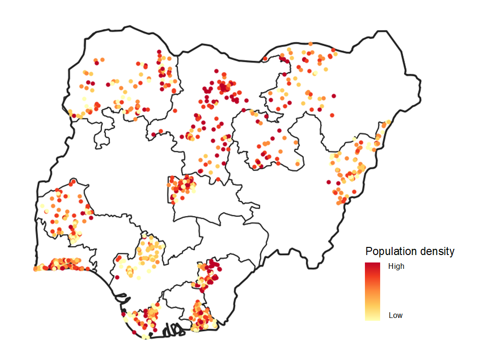

```{r logo, echo=FALSE}
###LOAD WP LOGO##
htmltools::img(src = knitr::image_uri("../../assets/pic/320px-UNFPA_logo.svg.png"),
               alt = 'logo', style = 'position:absolute; top:60px; right:0; padding:20px; width: 25%; height: auto')

knitr::opts_chunk$set(fig.align = "center") 

local({
  hook_output <- knitr::knit_hooks$get('warning')
  knitr::knit_hooks$set(warning = function(x, options) {
    if (!is.null(options$max.height)) options$attr.warning <- c(
      options$attr.warning,
      sprintf('style="max-height: %s;"', options$max.height)
    )
    hook_output(x, options)
  })
})
```


```{r, class.source = 'fold-hide', warning=F, message=F}
# 1 Set-up ---

# load libraries
library(tidyverse) # managing data
library(ggdag) # drawing DAG
library(kableExtra) # visualising table
library(here) # handling path
library(rstan) # running Bayesian models
library(plotly) # interactive plot
library(extraDistr) # for additional probability distributions

# stan setup
options(mc.cores = parallel::detectCores()-1)
rstan::rstan_options(auto_write = TRUE) # speed up running time of compiled model
```

# Introduction

In tutorial 1, we modelled population count with a Poisson-Lognormal
model. This modelling does not include site-level variations of
population count.

Tutorial 2 will explore the spatial patterns of population counts and
how they are clustered across space.

We will analyse the grouping of our observations and unravel their
hierarchical structure. We will then see how Bayesian models offer a
great modelling toolbox to represent hierarchical data. We will finally
try different hierarchical modelling structures to see which one fits
our data best.

Hierarchical models define complex parameter space. We will thus start
discussing about efficiency in model coding and how to tune the Markov
Chains Monte Carlo algorithm.

### Goals

1.  Understand the concept of grouped observations
2.  Estimate population density in a no-pooling framework
3.  Estimate population density in a partial pooling framework
4.  Address some MCMC estimation issues

### Supporting readings

-   [An Introduction to Hierarchical
    Modeling](http://mfviz.com/hierarchical-models/) by Michael Freeman.
    Great visualisation of grouped data and goals of general
    hierarchical modelling

-   [Bayes rules Book on hierarchical
    model](https://www.bayesrulesbook.com/chapter-15.html) by Alicia A.
    Johnson, Miles Ott, Mine Dogucu. Good explanation of hierarchically
    modelling in `stan` with many examples

-   [Brief guide to stan's
    warning](https://mc-stan.org/misc/warnings.html): Tuning Parameters
    for Hamiltonian Monte Carlo in `stan`

-   [Exchangeability and hierarchical
    model](https://users.aalto.fi/~ave/BDA3.pdf) in Bayesian Data
    Analysis (p.104) by Andrew Gelman, John Carlin, Hal Stern, Donald
    Rubin, David Dunson, and Aki Vehtari

### Extra package

We will use the `bayesplot` package that offers more flexibility in
evaluating Bayesian estimations, `plotly` for interactive plotting and
`extratDistr` for additional probability distributions.

```{r, eval=F}
install.packages('bayesplot') # additional evaluations of stan models
install.packages('plotly') # interactive plot
install.packages('extraDistr') # additional probability distribution
```

# Hierarchical structure in the data

Let's unravel the clustering patterns in population count. Figure
\@ref(fig:pop-map) shows the spatial variation of population density
across Nigeria. We choose to represent the population density
(people/settled hectares) because it is more comparable across survey
sites.

We can observed clustered patterns such as high population densities in
the North and the Southeast.

```{r pop-map, echo=F,fig.cap='Map of survey site population densities overlaid with Nigeria region boundaries', purl=F}


```

Let's plot the population density distribution by regions:

```{r popDens-boxplot, class.source = 'fold-hide', fig.cap='Boxplot of population densities per region'}
library(RColorBrewer)

# prepare data
data <- readxl::read_excel(here('tutorials/data/nga_demo_data.xls'))
data <- data %>% 
  mutate(
    id = as.character(1:nrow(data)),
    pop_density=N/A
  )

# plot population density per region
ggplot(data %>% 
         group_by(
           region
         ) %>% 
         mutate(mean_popDens = mean(pop_density)) %>% 
         ungroup(), aes(fill=mean_popDens, x=pop_density, y=as.factor(region)))+
  geom_boxplot()+
  theme_minimal()+
  scale_fill_stepsn( colours = brewer.pal(6, "YlOrRd"))+
  labs(fill='Mean \npopulation \ndensity', x='Population density', y='Region')
```

In addition to the 11 regions, the data provides two other **Nigerian
administrative divisions**: state (15) and local (standing for local
government areas, 223), which gives extra flexibility for grouping the
survey sites. The underlying assumption: the administrative structure of
a country gives information on the population density variation.

Another key grouping is the `type` attribute indicated in the data. It
refers to a settlement map based on satellite imagery (Pleiades, Airbus
and WorldView2, DigitalGlobe) classified into eight **settlement types**
pictured in Figure \@ref(fig:sett-map) @weber2018.

```{r sett-map, echo=F, fig.cap='Exemplars of the urban residential (A–F), rural residential (M), and non-residential (Z) types for Kano and Kaduna states, Nigeria, from Weber et al (2018)'}
knitr::include_graphics(here('./assets/pic/tuto2_settlement.jpg'))
```

```{r popDens-boxplot-type, class.source = 'fold-hide', fig.cap='Boxplot of population densities per settlement type'}
# plot population density per settlement type
ggplot(data %>% 
         group_by(
           type
         ) %>% 
         mutate(mean_popDens = mean(pop_density)) %>% 
         ungroup(), aes(fill=mean_popDens, x=pop_density, y=as.factor(type)))+
  geom_boxplot()+
  theme_minimal()+
  scale_fill_stepsn( colours = brewer.pal(6, "YlOrRd"))+
  labs(fill='Population density \n(mean)', x='', y='Settlement type')
```

We see that settlement type clearly stratifies the population density,
settlement type 1 having a substantial higher population density than
settlement type 4.

Note that out of the eight settlement types displayed in Figure
\@ref(fig:sett-map), only five types are actually present in the data:

1.  No sites were surveyed in the non-residential type area (Z).

2.  Types C, D and E have been merged together to enforce their
    prevalence in the South region

## Full picture of the data grouping

Figure \@ref(fig:group-schema) shows the full structure of the survey
sites, with the following nesting: settlement type, region, state and
local government area. When hovering on the schema, you can see how many
survey survey sites are in each grouping. You can access the detailed
structure by clicking on a specific group.

```{r group-schema, message=F, warning=F,class.source = 'fold-hide', fig.cap='Full grouping structure of the survey (settlement, region, state, local)'}
library(plotly)
# create unique id for the nested admin level
data1 <- data %>% 
  mutate(state= paste0(state,region),
         local = paste0(state, local))

# create data for sunburst plot
d1 <- rbind(
  # first layer
  data1 %>% 
    group_by(type) %>% 
    summarise(n=n()) %>% 
    mutate(
      ids = paste0('settlement', type),
      labels = paste0('settlement <br>', type),
      parents = '') %>% 
    ungroup() %>% 
    select(ids,labels, parents,n),
  # second layer
  data1 %>% 
    group_by(type, region) %>% 
    summarise(n=n()) %>% 
    mutate(
      ids = paste('settlement', type, '-', 'region', region),
      labels = paste0('region ', region),
      parents = paste0('settlement', type))%>% 
    ungroup() %>% 
    select(ids,labels, parents,n),
  # third layer
  data1 %>% 
    group_by(type, region, state) %>% 
    summarise(n=n()) %>% 
    mutate(
      ids = paste('settlement', type, '-', 'region', region, '-', 'state', state, '-', 'region', region),
      labels = paste0('state ', state),
      parents = paste('settlement', type, '-', 'region', region))%>% 
    ungroup() %>% 
    select(ids,labels, parents,n),
  # fourth layer
  data1 %>% 
    group_by(type, region, state, local) %>% 
    summarise(n=n()) %>% 
    mutate(
      ids = paste('settlement', type, '-', 'region', region, '-', 'state', state,  '-', 'local', local),
      labels = paste0('local ', local),
      parents = paste('settlement', type, '-', 'region', region, '-', 'state', state, '-', 'region', region))%>% 
    ungroup() %>% 
    select(ids,labels, parents,n)
) %>% 
  mutate(
    hover= paste(ids, '\n sample size', n)
  )

plot_ly(d1, ids = ~ids, labels = ~labels, parents = ~parents, type = 'sunburst', 
        hovertext=~hover, insidetextorientation='radial')
```

Note that:

1.  not every state and local government area are present in the data
    due to sampling limitations

2.  not every group combination is represented in the data. Some
    region/state/local governmental area do not have survey sites
    belonging to all settlement types. Figure
    \@ref(fig:group-complete-schema) shows the regions with missing
    settlement type. We can't assess from this analysis if those
    settlement types are missing because they have not being sampled in
    our survey or they don't exist (for example a remote region that
    does not contain any highly urban settlement type).

```{r group-complete-schema, message=F, warning=F,class.source = 'fold-hide', fig.cap='Grouping structure of the survey (settlement, region) with missing combination in yellow'}
makeSunburst2layer <- function(data){
  layers <- rbind(
  # first layer
  data %>% 
    group_by(type) %>% 
    summarise(n=sum(!is.na(N))) %>% 
    mutate(
      ids = paste0('settlement', type),
      labels = paste0('settlement <br>', type),
      parents = '') %>% 
    ungroup() %>% 
    select(ids,labels, parents,n),
  # second layer
  data %>% 
    group_by(type, region) %>% 
    summarise(n=sum(!is.na(N))) %>% 
    mutate(
      ids = paste('settlement', type, '-', 'region', region),
      labels = paste0('region ', region),
      parents = paste0('settlement', type))%>% 
    ungroup() %>% 
    select(ids,labels, parents,n)) %>%
    mutate(
      hover= paste(ids, '\n sample size', n),
      color= ifelse(n==0, 'yellow','')
    )
  
 return(layers)
}

# create missing combinations
data1_complete <- data1 %>% 
  complete(region, nesting(type)) 


plot_ly() %>% 
   add_trace(data=makeSunburst2layer(data1), 
             ids = ~ids, labels = ~labels, parents = ~parents, 
             type = 'sunburst', 
             hovertext=~hover, marker= list(colors=~color),  
             insidetextorientation='radial',
             domain = list(column = 0)) %>% 
     add_trace(data=makeSunburst2layer(data1_complete), 
             ids = ~ids, labels = ~labels, parents = ~parents, 
             type = 'sunburst', 
             hovertext=~hover, marker= list(colors=~color),  
             insidetextorientation='radial',
             domain = list(column = 1))  %>%  
  layout(
      grid = list(columns =2, rows = 1),
      margin = list(l = 0, r = 0, b = 0, t = 0))
```

# Hierarchical structure in the model

When all observations are treated together and indistinctly in the
model, it is called **complete pooling**. This is how we modelled
population count in tutorial 1. It assumes perfect exchangeability[^1]
between the observations, that is the indexing of the clusters doesn't
impact the probability of the population density. In other words, it
assumes that no ordering or grouping of the data can be made.
*Generally, the less we know about a problem, the more confidently we
can make claims of exchangeability.* The consequence of complete pooling
is that single parameters are estimated for the entire dataset such that
it might produce spurious conclusions that are valid at global level but
invalid at group level, through diluting group-specific patterns (cf.
the [ecological
fallacy](https://en.wikipedia.org/wiki/Ecological_fallacy)).

[^1]: An excellent example of the concept of exchangeability is provided
    in the *Bayesian data analysis* book, proposed as supporting
    readings.

When a model is fit for each data grouping independently, it is called
**no pooling** and create a model per grouping. It reduces drastically
the sample size and makes it impossible to extrapolate for a grouping
that is not present in the observations sample.

The purpose of hierarchical modelling is to aim at **partial pooling**
where information is shared between group while accounting for the
hierarchical structure of the data. It provides insights on:

-   between-group variability: population densities differ from one
    region to the other

-   within-group variability: some regions have a greater variability
    than others (cf region 9 in Figure \@ref(fig:popDens-boxplot))

**Link between random model and hierarchical models**: Random models are
any model that assumes that parameters are not fixed but varying by
groups, that is have a *random effect*. Hierarchical models are random
models that provides a overarching structure to draw information from
other groups.

Let's recall our previous model:

```{=tex}
\begin{equation}

population 〜 Poisson( pop\_density * settled\_area) \\

pop\_density 〜 Lognormal( \mu, \sigma) \\


\\\\


\mu 〜 Normal( 5, 4 ) \\

\sigma 〜 Uniform( 0, 4 )

\end{equation}
```
$\mu$ and $\sigma$ have both a fixed effect: they are estimated for the
entire dataset at once.

## A hierarchical intercept by settlement type

We want to differentiate the parameters according to the hierarchical
structure of the data.

A first parameter is $\mu$, that is the median on the log scale of the
population density distribution. Modelling $\mu$ hierarchically means
acknowledging that the median differs depending on the grouping, for
example different for settlement type 1 from settlement type 4. From now
on we will decompose $\mu$ into a $\alpha$ term for which we will design
a random effect.

Let's see the different scenarios for estimating $\alpha$ by settlement
type (we will show only for three settlement types for sake of
simplicity):

```{r, class.source = 'fold-hide'}
d1 <- dagify(
    Y ~ alpha,
    outcome = 'Y'
  ) %>%
    tidy_dagitty(seed=1) %>% 
    mutate(color=c('parameter','data')) %>% 
    ggplot(aes(x = x, y = y, xend = xend, yend = yend, color=color,shape=color)) +
    geom_dag_point() +
    geom_dag_edges() +
    geom_dag_text(col = "grey20",size=4,  parse=T) +
    scale_shape_manual(values=c(15,19))+
    theme_dag()+ guides(color='none', shape='none')+ labs(title = 'Complete pooling', color='', shape='')

d2 <- dagify(
    Y ~ alpha_1+alpha_2+ alpha_3,
    outcome = 'Y'
  ) %>%
    tidy_dagitty(seed=1) %>% 
    mutate(color=c('parameter','parameter','parameter','data')) %>% 
    ggplot(aes(x = x, y = y, xend = xend, yend = yend, color=color,shape=color)) +
    geom_dag_point() +
    geom_dag_edges() +
    geom_dag_text(col = "grey20",size=4,  parse=T) +
    scale_shape_manual(values=c(15,19))+
    theme_dag()+ guides(color='none', shape='none')+ labs(title = 'No pooling', color='', shape='')

d3 <- dagify(
    Y ~ alpha_1+alpha_2+ alpha_3,
    alpha_1 ~ alpha,
    alpha_2 ~ alpha,
    alpha_3 ~ alpha,
    outcome = 'Y',
    latent = 'alpha'
  ) %>%
    tidy_dagitty(seed=7) %>% 
    mutate(color=c('parameter','parameter','parameter','parameter','parameter','parameter','data')) %>% 
    ggplot(aes(x = x, y = y, xend = xend, yend = yend, color=color,shape=color)) +
    geom_dag_point() +
    geom_dag_edges() +
    geom_dag_text(col = "grey20",size=4,  parse=T) +
    scale_shape_manual(values=c(15,19))+
    theme_dag()+ guides(color='none', shape='none')+ labs(title = 'Partial pooling', color='', shape='')

gridExtra::grid.arrange(d1,d2,d3, ncol=3)
```

We will see the difference between the three models: complete pooling
(one $\alpha$), no pooling (3 $\alpha$s) and partial pooling (3 $\alpha$
+ 1 overarching $\alpha$).

**Model 2 from tutorial 1 is based on complete pooling of the data or
fixed effect: a unique** $\alpha$ **for all settlement type.**

### No-pooling

Let's implement a no-pooling framework, that is $\alpha$ **will be
estimated independently for each settlement type** $t$. Equation
\@ref(eq:model1) represents its formal model, whereby $\alpha$ is
indexed by $t$ the settlement type and each $\alpha_t$ has a identical
but independent prior *Normal(5,4)*.

```{=tex}
\begin{equation}

population 〜 Poisson( pop\_density * settled\_area) \\

pop\_density 〜 Lognormal( \alpha_t, \sigma) \\[5pt]


\alpha_t 〜 Normal( 5, 4 ) \\

\sigma 〜 Uniform( 0, 4 )(\#eq:model1)

\end{equation}
```
How do you write it in Stan? We will show only the code that is
impacted.

```{stan output.var="simpleCode", eval=F }
// Model 1: Independent alpha by settlement type
data{
  ...
  int<lower=0> type[n]; // settlement type
  int<lower=0> ntype; // number of settlement types
}
parameters{
  ...
  // independent intercept by settlement type
  vector[ntype] alpha_t; 
}
model{
  // population totals
  ...
  pop_density ~ lognormal( alpha_t[type], sigma );
  
  // independent intercept by settlement type
  alpha_t ~ normal(5, 4);
  ...
}
generated quantities{
  ...
   for(idx in 1:n){
     density_hat[idx] = lognormal_rng( alpha_t[type[idx]], sigma );
     population_hat[idx] = poisson_rng(density_hat[idx] * area[idx]);
   }
}

```

In the `data block` , we declare the observation structure of settlement
type.

In the `parameters block` , $\alpha$ becomes a vector of size 5, the
number of settlement type in the data.

In the `model block,`we choose the same prior for every $\alpha_t$, five
normal distribution centered on 5 and with standard deviation 4.

Notice how the indexing works in the `generated quantities block`.

Once the model is written, we prepare the corresponding data, adding the
settlement type:

```{r}
# prepare data for stan
stan_data_model1 <- list(
  population = data$N,
  n = nrow(data),
  area = data$A,
  type = data$type,
  ntype= n_distinct(data$type))

```

And run the model in a similar fashion as in tutorial 1:

```{r}
# mcmc settings
chains <- 4
warmup <- 250
iter <- 500
seed <- 1789

# parameters to monitor
pars <- c('alpha_t','sigma', 'population_hat', 'density_hat')

# mcmc
fit1 <- rstan::stan(file = file.path('tutorial2_model1.stan'), 
                   data = stan_data_model1,
                   iter = warmup + iter, 
                   chains = chains,
                   warmup = warmup, 
                   pars = pars,
                   seed = seed)
```

No warnings is spit by `stan` , the model has converged.

Figure \@ref(fig:model1-alpha-t) shows that the estimated $\hat\alpha_t$
vary by settlement type. We also see how the previously estimated
$\alpha$ was averaging between the different patterns.

```{r model1-alpha-t, class.source = 'fold-hide', message=F, warning=F, fig.cap='Intercept estimated independantly by settlement type'}

# plot estimated parameter
stan_plot(fit1, pars='alpha_t', fill_color='orange')+
  # add alpha from tutorial 1
  geom_vline(xintercept=4.755109, size=1.5, linetype=2)+
  annotate('text', x=5, y=5.7, label="alpha estimated \nin tutorial 1")
```

We draw the observed vs predicted plot to see the impact of estimating
$\alpha$ by settlement type:

```{r, class.source = 'fold-hide', message=F, fig.cap='Comparison of observations with predictions from model 1', warning=F}
# write function to extract posterior predictions and summarise them in a table
getPopPredictions <- function(model_fit, 
                              estimate='population_hat',
                              obs='N', reference_data=data){
  # extract predictions
  predicted_pop <- as_tibble(extract(model_fit, estimate)[[estimate]])
  colnames(predicted_pop) <- reference_data$id
  
  # summarise predictions
  predicted_pop <- predicted_pop %>% 
    pivot_longer(everything(),names_to = 'id', values_to = 'predicted') %>% 
    group_by(id) %>% 
    summarise(across(everything(), list(mean=~mean(.), 
                                        upper=~quantile(., probs=0.975), 
                                        lower=~quantile(., probs=0.025)))) %>% 
    left_join(reference_data %>% 
                rename('reference'=all_of(obs)) %>% 
                select(id, reference), by = 'id')%>% 
    mutate(
      residual= predicted_mean - reference,
      ci_size = predicted_upper- predicted_lower,
      estimate = estimate
      )

return(predicted_pop)
}

# plot posterior predictions
ggplot(
  rbind(
    getPopPredictions(fit1) %>% 
      mutate(type='Population count'),
    getPopPredictions(fit1, estimate = 'density_hat', obs='pop_density') %>% 
      mutate(type='Population density')
  )  %>% 
         mutate(type= factor(type, levels=c('Population density', 'Population count')))) +
  geom_pointrange(aes(x=reference, y=predicted_mean, ymin=predicted_lower, ymax=predicted_upper
                      ),
                   fill='grey50', color='grey70', shape=21
                  )+
  geom_abline(slope=1, intercept = 0, color='orange', size=1)+
  theme_minimal()+
  labs(title = '', x='Observations', y='Predictions')+ 
  facet_wrap(.~type, scales = 'free')

```

We see that the predicted population density has now five modes that
corresponds to the five settlement types.

### Partial pooling

Let's try now **partial pooling**. Partial-pooling involves a
hierarchical set-up for the priors, that is, each $\alpha_t$ prior
distribution will depend on an overarching $\alpha$ prior distribution.
In other words, $\alpha$ defines a country-wide distribution that
constrains each $\alpha_t$ to be in a similar range.

```{=tex}
\begin{equation}

population 〜 Poisson( pop\_density * settled\_area) \\

pop\_density 〜 Lognormal( \alpha_t, \sigma) \\[5pt]


\alpha_t 〜 Normal( \alpha, \nu_\alpha  ) \\[5pt]
\alpha 〜 Normal( 5, 10 ) \\
\nu_\alpha 〜 Uniform( 0, 15 ) \\
\sigma 〜 Uniform( 0, 10 )(\#eq:model2)

\end{equation}
```
Note that:

1.  $\alpha_t$, the random effects are each drawn from a Normal
    distribution with the same overarching *hyperparameters* $\alpha$
    and $\nu_\alpha$.

2.  We relax the prior constrain on $\alpha$ and $\sigma$ from a
    Normal(5, 4) and Uniform (0,4) to a Normal(5,10) and Uniform(0,10).
    Hierarchical models are complex to estimate as some parameters are
    defined as correlated. We therefore offer to the algorithm more
    space to explore.

3.  We set as hyperprior for $\nu_\alpha$, the standard deviation of the
    random effect prior, a Uniform(0, 15), because standard deviations
    are positive. We set up a wider range for $\nu_\alpha$ than for
    $\sigma$ because from experience standard deviations of
    hierarchically defined parameters are more difficult to estimate
    than other standard deviations (see point 2).

In `stan` we will write the mode like that:

```{stan output.var="simpleCode", eval=F }
// Model 2: Hierarchical alpha by settlement type
parameters{
  ...
  // hierarchical intercept by settlement
  vector[ntype] alpha_t; 
  real alpha;
  real<lower=0> nu_alpha;
}
model{
  ...
  // hierarchical intercept by settlement
  alpha_t ~ normal(alpha, nu_alpha);
  alpha ~ normal(5, 10);
  nu_alpha ~ uniform(0, 15);
}
```

We add the new parameters to the parameters to monitor and we run the
model:

```{r}
pars <- c('alpha_t','alpha', 'nu_alpha', 'sigma', 'population_hat', 'density_hat')

# mcmc
fit2 <- rstan::stan(file = file.path('tutorial2_model2.stan'), 
                   data = stan_data_model1,
                   iter = warmup + iter, 
                   chains = chains,
                   warmup = warmup, 
                   pars = pars,
                   seed = seed)
```

We can now compare the estimated parameters between a no pooling and a
partial pooling framework.

```{r comp-alpha-t, fig.cap='Comparison between alpha_t estimated independently and hierarchically',class.source = 'fold-hide'}
fit2_alpha_t <- summary(fit2, pars=c('alpha_t'))$summary
fit1_alpha_t <-  summary(fit1, pars=c('alpha_t'))$summary
data_plot <- rbind(
  as_tibble(fit1_alpha_t, rownames='param') %>% 
    mutate(model='No pooling'),
    as_tibble(fit2_alpha_t, rownames='param') %>% 
    mutate(model='Partial pooling')
) %>% 
  mutate(
    model = factor(model, levels=c('No pooling','Partial pooling')),
    param_ = paste(param,model),
    labels = ifelse(model=='Partial pooling', param, '')) %>% 
arrange(param_)

ggplot(data_plot, aes(mean,param_, color=model, fill=model,label=labels))+
  geom_point()+
  geom_linerange(aes(xmin=`2.5%`, xmax=`97.5%`))+
  theme_minimal()+
  labs(y='')+
    scale_y_discrete(labels=data_plot$labels)

```

There are not striking differences between the two models, but the
no-pooling framework tends to over estimate the gap between each random
effect, whereas the partial pooling framework tends to pull the random
effects towards each other. Table \@ref(tab:metrics-comp-pooling) shows
how incorporating the settlement type grouping has a direct effect on
the prediction.

```{r metrics-comp-pooling,class.source = 'fold-hide'}
# load previous model for complete pooling
fit_tuto1_model2 <- readRDS('../tutorial1/tutorial1_model2_fit.rds')

# build comprehensive dataframe
comparison_df <- rbind(
 getPopPredictions(fit1) %>% 
   mutate(model='No pooling'),
 getPopPredictions(fit2) %>% 
   mutate(model='Partial pooling'),
 getPopPredictions(fit_tuto1_model2) %>% 
   mutate(model='Complete pooling'))


# compute goodness-of-fit metrics
comparison_df %>% group_by(model) %>% 
  summarise( `Bias`= mean(residual),
    `Inaccuracy` = mean(abs(residual)),
        `Imprecision` = sd(residual)
) %>%  kbl(caption = 'Goodness-of-metrics comparison between complete pooling, no pooling, and partial pooling') %>% kable_minimal()
```

Estimating $\alpha$ by settlement type does improve the model as shown
by smaller residuals (*Bias* and *Imprecision*) and less variation
(*Inaccuracy*). The hierarchical model does reduce slightly *Bias* but
not strikingly, which indicates that the number of survey sites per
settlement type was big enough to estimate the $\alpha_t$ independently,
in a no-pooling framework.

We will see however in the next section the second advantage of
hierarchical modelling.

## A hierarchical intercept by settlement type and region

Taking into account the settlement type stratification of population
count leads to more accurate predictions and reduces prediction
uncertainty (see Table \@ref(tab:metrics-comp-pooling)).

We can include further grouping in the modelling, such as administrative
divisions.

Let's include region in the modelling:

```{=tex}
\begin{equation}

population 〜 Poisson( pop\_density * settled\_area) \\

pop\_density 〜 Lognormal( \alpha_{t,r}, \sigma) \\[5pt]
\alpha_{t,r} 〜 Normal(\alpha_t, \nu_t) \\
\alpha_t 〜 Normal( \alpha, \nu) \\[5pt]

\alpha 〜 Normal( 5, 10 ) \\
\nu 〜 Uniform( 0, 15 ) \\
\nu_t 〜 Uniform( 0, 15 ) \\
\sigma 〜 Uniform( 0, 10 )
\end{equation}
```
### Implementing the model

The model is translated in `stan` as :

```{stan output.var="simpleCode", eval=F }
// Model 3: Hierarchical alpha by settlement type and region

data{
  ...
  int<lower=1> nregion; //number of regions
  int<lower=1,upper=nregion> region[n]; // region
}
parameters{
  ...
  // hierarchical intercept by settlement and region
  real alpha;
  
  vector[ntype] alpha_t; 
  vector[nregion] alpha_t_r[ntype];
  
  real<lower=0> nu_alpha;
  real<lower=0> nu_alpha_t;
}
transformed parameters{
  vector[n] pop_density_mean;
  
  for(idx in 1:n){
    pop_density_mean[idx] = alpha_t_r[type[idx],region[idx]];
  }
}
model{
  pop_density ~ lognormal(pop_density_mean, sigma );

  // hierarchical intercept by settlement and region
  alpha ~ normal(5, 10);
  nu_alpha ~ uniform(0, 15);
  nu_alpha_t ~ uniform(0, 15);
  
  alpha_t ~ normal(alpha, nu_alpha);
  
  for(t in 1:ntype){
    alpha_t_r[t,] ~ normal(alpha_t[t], nu_alpha_t); 
  }
  ...
}
generated quantities{
  ...
  density_hat[idx] = lognormal_rng( alpha_t_r[type[idx], region[idx]], sigma );
}
```

Note the new `transformed parameters` block: it is useful to keep your
`model` block tidy with only the stochastic relationships.

We add the region indexing to the data list prepared for stan:

```{r}
# prepare data for stan
stan_data_model3 <- list(
  population = data$N,
  n = nrow(data),
  area = data$A,
  type = data$type,
  ntype= n_distinct(data$type),
  region = data$region,
  nregion = n_distinct(data$region)
  )

```

And run the model with the new parameters to monitor:

```{r, max.height='150px'}
pars <- c('alpha','alpha_t','alpha_t_r','nu_alpha', 'sigma','population_hat',  'density_hat')

# mcmc
fit3 <- rstan::stan(file = file.path('tutorial2_model3.stan'), 
                   data = stan_data_model3,
                   iter = warmup + iter, 
                   chains = chains,
                   warmup = warmup, 
                   pars = pars,
                   seed = seed)
```

Stan tells us that "The following variables have undefined values:
population_hat[1],". This is due to **integer overflow:** the limit of
integer value is 2\^31 - 1. To make sure we don't go over this limit,
stan restricts the value for the Poisson rate to 1.07374e+09. 

This issue happens however only for the prediction and during the warmup period.
When the chains reach convergence, the Poisson rate becomes reasonable and `population_hat` becomes defined.
We show here the example for cluster 2 prediction process :

```{r, fig.cap='Traceplot for cluster 2'}
traceplot(fit3, 'density_hat[2]', inc_warmup=T)
```


### Estimated parameters

Let's look at the estimated $\hat\alpha_{t,r}$. Since there are 1
$\hat\alpha$, 5 $\hat\alpha_t$ and 5x11 $\hat\alpha_{t,r}$, we will zoom
in two settlement types in particular, 1 and 4. To do so, remember how
the parameter names are constructed:

-   `alpha_t` is a vector of dimension 5, such that `alpha_t[1]`
    represents $\hat{\alpha_1}$, the estimate associated to settlement 1

-   `alpha_t_r` is a vector of dimension 5\*11, such that `alpha_t[1,1]`
    represents $\hat{\alpha}_{1,1}$, the estimate associated to
    settlement 1 and region 1.


```{r alpha-sett-region, message=F, fig.cap='Estimated alpha by region for settlement 1 and 4'}
alpha_4_r <- paste0('alpha_t_r[4,', 1:11, ']')
alpha_1_r <- paste0('alpha_t_r[1,', 1:11, ']')

stan_plot(fit3, pars=c('alpha','alpha_t[1]','alpha_t[4]', alpha_1_r, alpha_4_r), 
          fill_color='orange')

```

We see that:

1.  $\hat\alpha$ has a estimated distribution that overlaps the two
    settlement types, and wider confidence interval to account for all
    the uncertainty

2.  $\hat\alpha_1$ and $\hat\alpha_2$ have two distinctive patterns

3.  the two settlement-level patterns mask regional disparities

A fourth remark: look closely at region 4 and 10, that is to say
$\hat\alpha_{1,4}$, $\hat\alpha_{1,10}$,$\hat\alpha_{2,4}$ and
$\hat\alpha_{2,10}$. We see that the confidence intervals are larger
than for any other region.

This is because those two regions comprise only one settlement type (5)
in the data (see Figure \@ref(fig:group-complete-schema)) and thus
neither settlement type 1 nor settlement type 4. Therefore there is no
data to inform those $\alpha_{t,r}$, but because of the hierarchy, they
can be estimated from the global parameter $\alpha_t$. And indeed we see
that their estimated means closely match the respective $\hat\alpha_t$.

This feature of hierarchical setting is a **great advantage compared to
the non-pooling setting**. When predicting population count across
Nigeria, we might find out settlement type in a region that was not
represented in our dataset, typically type 1, 2, 3 or 4 in region 4 or
10. In a non-pooling setting we won't have any parameter estimated
because the models are estimated independently per level combination
that is for a type x region. In a partial-pooling setting or
hierarchical model we are covered by the global $\alpha_t$. Obviously
there will be more uncertainty in the prediction for this specific area
because no data could be used to fit the model.

This ability of a hierarchical model holds also if an entire grouping
was not sampled, typically if a region was not included in the survey.
However it means that this missing region will be estimated with
observations from the other sampled regions. If the missing region has
very different characteristics, the model will not be able to capture
them.

Finally we can see the effect of a two-level hierarchy on the model
predictions for every survey sites.

```{r, class.source = 'fold-hide'}
# build comprehensive dataframe
comparison_df <- rbind(
  comparison_df,
 getPopPredictions(fit3) %>% 
   mutate(model='Hierarchical - settlement, region'))

# compute goodness-of-fit metrics
comparison_df %>% 
  mutate(model =ifelse(model=='Partial pooling', 'Hierarchical - settlement', model)) %>% 
  filter(grepl('Hierarchical', model))  %>% group_by(model) %>% 
  summarise( `Bias`= mean(residual),
    `Inaccuracy` = mean(abs(residual)),
        `Imprecision` = sd(residual)
) %>%  kbl(caption = 'Goodness-of-metrics comparison of the hierarchical models') %>% kable_minimal()
```
We will store model 3 to use as comparison in tutorial 2.

```{r, eval=F}
saveRDS(fit3, 'tutorial2_model3_fit.rds')
```


# Acknowledgements

This tutorial was written by Edith Darin from WorldPop, University of
Southampton and Douglas Leasure from Leverhulme Centre for Demographic
Science, University of Oxford.

Funding for the work was provided by the United Nations Population Fund.

# References
