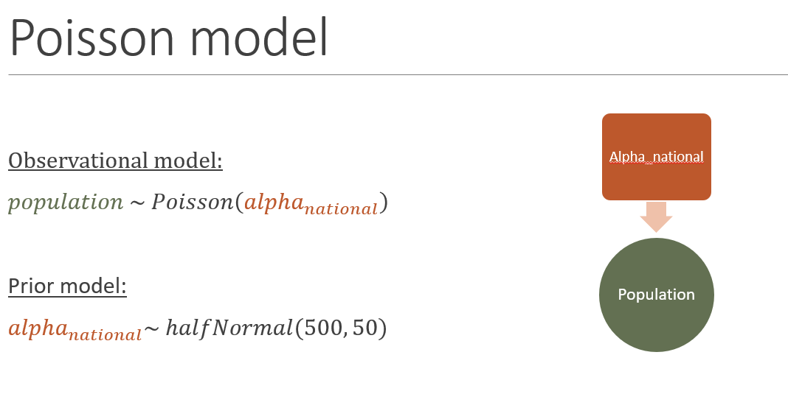
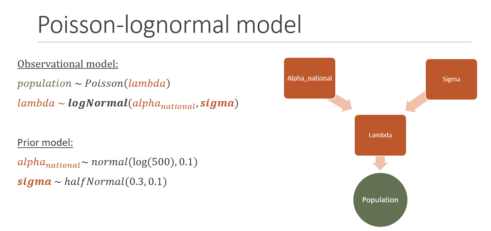
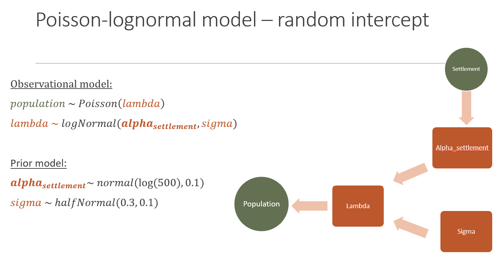
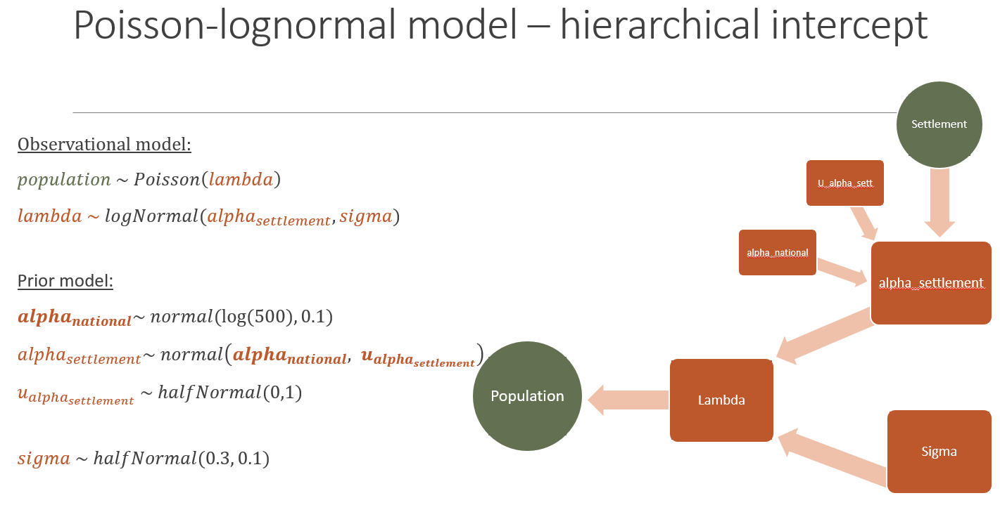
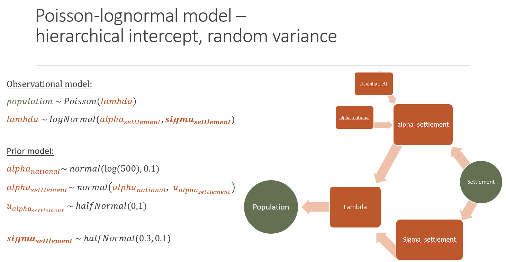
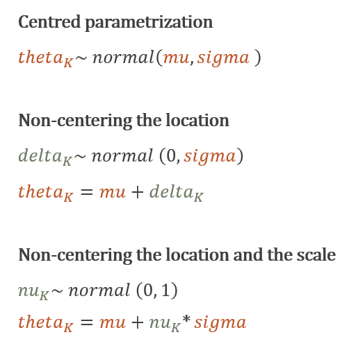

```{r logo, echo=FALSE, purl=F}
###LOAD WP LOGO##
htmltools::img(src = knitr::image_uri("../../assets/pic/320px-UNFPA_logo.svg.png"),
               alt = 'logo', style = 'position:absolute; top:60px; right:0; padding:20px; width: 25%; height: auto')
local({
  hook_output <- knitr::knit_hooks$get('warning')
  knitr::knit_hooks$set(warning = function(x, options) {
    if (!is.null(options$max.height)) options$attr.warning <- c(
      options$attr.warning,
      sprintf('style="max-height: %s;"', options$max.height)
    )
    hook_output(x, options)
  })
})
```

```{r, echo=F, fig.show="hold", out.width="20%"}


```

```{r, include=F}
# 1 Set-up ----

# load libraries
library(tidyverse) # managing data
library(plotly) # drawing interactive plots
library(kableExtra) # visualising table
library(here) # handling path
library(rstan) # running Bayesian models
library(patchwork) # side by side ggplots
```

# Introduction

In this section, we build on the lessons covered in tutorial 1 to 4
to model a new population count data. We will underline the
importance of producing a **narrative about the data generating
process** to support the modelling workflow. We will also have a word
about estimation issues arising from complex hierarchical models that
can be tackle with a change in **model parametrisation.**

### Goals

1.  Develop step-by-step a modelling workflow for population count

2.  Understand the iterative modelling process based on assessing models
limitations

3.  Unravel the impact of parametrisation on estimation convergence

### Supporting readings

The reading list encompasses all references mentioned in tutorial 1-4.
An additional resource very valuable for moving to the next level in Bayesian modelling in Stan, is the writings from *Dr. Michael Betancourt*.

The key articles related to our population models are:

-  [Generative modelling](https://betanalpha.github.io/assets/case_studies/generative_modeling.html)
-  [Principled Bayesian workflow](https://betanalpha.github.io/assets/case_studies/principled_bayesian_workflow.html)
-  [Prior modelling](https://betanalpha.github.io/assets/case_studies/prior_modeling.html)
-  [Hierarchical modelling](https://betanalpha.github.io/assets/case_studies/hierarchical_modeling.html)

# Modelling workflow

Now let's apply our learning to the new data set. We first set up the session for running Stan models.

```{r}
# stan set-up
options(mc.cores = parallel::detectCores()-1)
rstan_options(auto_write = TRUE)
chains <- 4
iter <- 500
warmup <- 300
seed <- 12345677
```

We have a glance to the new data set that contains 1000 observations.

```{r}
observations <- read_csv(here('tutorials', 'workflow','observations.csv'),
                         col_types = "nn")

# Descriptive statistics --------------------------------------------------
hist(observations$pop)
```

The distribution of population counts roughly follows a bell curve centered around 550 people per cluster.

## Fit a Poisson model

Our target variable, population, is a count variable. We model it first using a Poisson
distribution that has a unique parameter the Poisson rate defining both the mean and the variance.

To define the prior of the Poisson rate, we use a half-normal to
constrain it to positive values and center it around 500 with a rather
wide variance of 50. We simulate this prior to see if the results look
reasonable.

```{r}
# Prior predictive check
alpha_national_simulated <- abs(rnorm(1000, 500, 50))
pop_poisson_simulated <- sapply(alpha_national_simulated, function(x) rpois(1, x))

hist(pop_poisson_simulated)
```

This prior model indicates a population count distribution centered
around 500 and as bound 300 and 700 people per cluster.

This first model can be summarised through a graph as follows (in
green circle the input data, in orange square the parameter):

```{r, echo=F, fig.cap ='Poisson model', fig.align='center'}

```

We fit the model.

```{r}
# fit the model
input_data <- list(
  n_obs =  nrow(observations),
  pop = observations$pop
)
pars_poisson <- c('alpha_national', 'pop_post_pred')

fit_poisson <- stan(
  file= here('tutorials', 'workflow', 'poisson.stan'),
  data= input_data,
  iter = iter + warmup,
  warmup = warmup,
  seed = seed,
  pars = pars_poisson
)

# extract model outputs
samples_poisson <- rstan::extract(fit_poisson)
```

Stan didn't warn us of any convergence issues. We double-check it with
a traceplot of the unique parameter *alpha_national*.

```{r}
# visualise convergence
traceplot(fit_poisson, pars = 'alpha_national')
```

The traceplot shows that the four chains converged and are stable.

We compare the estimated parameter posterior with its prior, known as a
*prior retrodictive check*.

```{r}
# prior retrodictive check
alpha_national <- tibble(
  posterior = samples_poisson$alpha_national,
  prior = abs(rnorm(chains*iter, 500, 50)),
  iter = 1:(chains*iter)
) %>% 
  pivot_longer(-iter, names_to = 'distribution')

ggplot(alpha_national, aes(x=value, fill=distribution))+
  geom_histogram(binwidth = 5)+
  theme_minimal()
```

We see that our prior is inline with the posterior and does not
over-constrained the estimation.

And finally, we compare the predicted population counts with the
observed counts trough a *posterior predictive check*.

```{r}
# posterior predictive check
pop_posterior <- tibble(
  source = factor(c(rep('predicted', iter*chains*input_data$n_obs), 
                    rep('Observed', input_data$n_obs)), 
                  levels = c('predicted', 'Observed')),
  value= c(as.vector(samples_poisson$pop_post_pred), input_data$pop)
)


ggplot(pop_posterior, aes(x=value, fill=source, after_stat(density)))+
  geom_histogram(binwidth=5, position='identity', alpha=0.7)+
  theme_minimal()
```

We see that the predicted population counts are over-concentrated around
the mean and do not account for the wider dispersion of the
observations. This is due to the Poisson distribution that has a unique
parameter ruling both its mean and variance.

## Fit a Poisson-lognormal model

To account for the over-dispersion, we use a second modelling component:
a lognormal with parameters the mean, $alpha_{national}$, and the variance, $sigma$. We define their priors to produce a reasonable population distribution: for alpha a
half-normal centered on log(500) - similar to the previous prior for the Poisson rate but on the logscale - and for sigma a half-normal centered on 0.3 (the standard deviation of the log of the observations is 0.2).

```{r}
# Prior predictive check
alpha_simulated <- abs(rnorm(1000, log(500), 0.1))
sigma_simulated <- abs(rnorm(1000, 0.3, 0.1))
lambda_simulated <- mapply( function(x,y) rlnorm(1, x, y), alpha_simulated, sigma_simulated )
pop_lognormal_simulated <- sapply(lambda_simulated, function(x) rpois(1, x))
comp_pop <- tibble(
  model = factor(c(rep('Poisson', length(pop_poisson_simulated)), 
                   rep('Poisson-lognormal',length(pop_lognormal_simulated))),
                 levels=c('Poisson-lognormal','Poisson')),
  value= c(pop_poisson_simulated,pop_lognormal_simulated)
)

ggplot(comp_pop, aes(x=value, fill=model))+
  geom_histogram(bins = 100,position='identity', alpha=0.8)+
  theme_minimal()+
  labs(fill='Prior model', x='Simulated population counts from the prior model', y='')
```

The Poisson-lognormal prior model does account for more variations than the Poisson-only prior model.

The Poisson-lognormal model can be summarised by the following graph:
```{r, echo=F, fig.cap ='Poisson-Lognormal model', fig.align='center'}

```

We run the model.
```{r}
# run the model
pars_lognormal <- c('alpha_national', 'sigma', 'pop_post_pred')

fit_poisson_lognormal <- stan(
  file= here('tutorials', 'workflow','poisson_lognormal.stan'),
  data= input_data,
  iter = iter + warmup,
  warmup = warmup,
  seed = seed,
  pars = pars_lognormal
)
```
No warnings are issued. We double-check with traceplots of the key parameters:

```{r, fig.show='hold'}
traceplot(fit_poisson_lognormal, pars = 'alpha_national')+
traceplot(fit_poisson_lognormal, pars = 'sigma')
```

We compare the posterior parameters with their priors.

```{r, fig.show="hold"}
samples_poisson_lognormal <- rstan::extract(fit_poisson_lognormal)

# prior retrodictive check
alpha_national <- tibble(
  posterior = samples_poisson_lognormal$alpha_national,
  prior = abs(rnorm(chains*iter, log(500), 0.1)),
  iter = 1:(chains*iter)
) %>% 
  pivot_longer(-iter, names_to = 'distribution')

sigma <- tibble(
  posterior = samples_poisson_lognormal$sigma,
  prior = abs(rnorm(chains*iter, 0.3, 0.1)),
  iter = 1:(chains*iter)) %>% 
  pivot_longer(-iter, names_to = 'distribution')

ggplot(alpha_national, aes(x=value, fill=distribution))+
  geom_histogram(bins=100, position='identity', alpha=0.8)+
  theme_minimal()+
  labs(title='Prior retrodictive check for alpha national')+
 ggplot(sigma, aes(x=value, fill=distribution))+
  geom_histogram(bins=100, position='identity', alpha=0.8)+
  theme_minimal()+
  labs(title='Prior retrodictive check for sigma')
```

We see that the priors are inline with the posteriors and do not
over-constrained the estimation.

Finally, we compare the predicted population counts with the
observed counts trough a *posterior predictive check*.

```{r}
# posterior predictive check
pop_posterior_lognormal <- tibble(
  source = factor(c(rep('Predicted - Poisson', iter*chains*input_data$n_obs), 
                    rep('Predicted - Poisson-lognormal', iter*chains*input_data$n_obs),
                    rep('Observed', input_data$n_obs)), 
                  levels = c('Observed', 'Predicted - Poisson-lognormal', 'Predicted - Poisson')),
  value= c(
    as.vector(samples_poisson$pop_post_pred), 
    as.vector(samples_poisson_lognormal$pop_post_pred), 
    input_data$pop)
)

ggplot(pop_posterior_lognormal, aes(x=value, fill=source, after_stat(density)))+
  geom_histogram(bins=100, position='identity', alpha=0.7)+
  theme_minimal()+
  labs(x='Population counts')
```

The posterior distribution - or predicted counts - from the Poisson-lognormal model has a shape that fits more closely the observed population counts. We see however that our observed distribution shows two distinct modes that can't be approached with a lognormal model that has only a single mean value.

## Fit a random intercept model

In our input data we have a second attribute that contains information on the settlement type, 1 or 2. Let's contrast the difference in the observed population distribution according to this attribute:

```{r}
# Descriptive statistics 
ggplot(observations, aes(x=pop, fill=as_factor(settlement), after_stat(density)))+
  geom_histogram(bins=50, position='identity', alpha=0.8)+
  theme_minimal()+
  labs(x='Observed population counts', fill='Settlement')
```

Distinguishing the population distribution per settlement type reveals that type 1 has clearly a higher population count than type 2.

We model that difference through a random slope model that estimates independently the mean of the lognormal per settlement type:

```{r, echo=F, fig.cap ='Independent random intercept model', fig.align='center'}

```

We run the model:

```{r, max.height='150px'}
# run the model
input_data <- list(
  n_obs =  nrow(observations),
  pop = observations$pop,
  n_settlement = length(unique(observations$settlement)),
  obs_to_settlement = as.integer(observations$settlement)
)
pars_lognormal_independent <- c('pop_post_pred', 'alpha_settlement',  'sigma')

fit_poisson_lognormal_independent <- stan(
  file= here('tutorials', 'workflow','poisson_independent.stan'),
  data= input_data,
  iter = iter + warmup,
  warmup = warmup,
  seed = seed,
  pars = pars_lognormal_independent
)
```

Stan issues a stack of the following warning: *The following variables have undefined values: pop_post_pred*. We already experienced this warning in tutorial 2 which is typical of a `poisson_rng` overflow: in the generated quantities block, the pop_post_pred is the outcome of the function `poisson_rng` that can't be given inputs too high (above 1.07374e+09). However this can happen during the warmup period when the parameter space is still being explored to find values of parameter that fits with both the prior and the data. We can safely ignore this warning.

We  check the traceplots for convergence issue:
```{r}
traceplot(fit_poisson_lognormal_independent, pars = 'alpha_settlement[1]')+
  traceplot(fit_poisson_lognormal_independent, pars = 'alpha_settlement[2]')+
traceplot(fit_poisson_lognormal_independent, pars = 'sigma')
```

We assess how the estimated parameters compare with their priors.
```{r}
samples_poisson_lognormal_independent <- rstan::extract(fit_poisson_lognormal_independent)

# prior retrodictive check
alpha_settlement <- as_tibble(samples_poisson_lognormal_independent$alpha_settlement,
                              .name_repair = 'minimal')
colnames(alpha_settlement) <- c('posterior_alpha_settlement_1', 'posterior_alpha_settlement_2')
alpha_settlement <- alpha_settlement %>% 
  mutate (
    prior = abs(rnorm(chains*iter, log(500), 0.1)),
    iter = 1:(chains*iter)
  ) %>% 
  pivot_longer(-iter, names_to = 'distribution')

ggplot(alpha_settlement, aes(x=value, fill=distribution))+
  geom_histogram(bins=100,position='identity', alpha=0.7)+
  theme_minimal()
```

The two $alpha_{settlement}$ are positioned at the two tails of the prior. The greater heterogeneity of the alpha_settlement estimates for settlement 2, visible through a wider histogram, is due to the fewer samples available in this category (200 vs 800).

We can now compare the posterior population counts with the observed values.
```{r}
# posterior predictive check
pop_posterior_lognormal_independent <- tibble(
  source = factor(c(
    rep('Predicted - Poisson-lognormal', iter*chains*input_data$n_obs),
    rep('Predicted - Poisson-lognormal independent', iter*chains*input_data$n_obs),
    rep('Observed', input_data$n_obs)), 
    levels = c('Observed','Predicted - Poisson-lognormal independent', 
               'Predicted - Poisson-lognormal')),
  value= c(
    as.vector(samples_poisson_lognormal$pop_post_pred), 
    as.vector(samples_poisson_lognormal_independent$pop_post_pred),
    input_data$pop)
)

ggplotly(ggplot(pop_posterior_lognormal_independent, aes(x=value, fill=source, after_stat(density)))+
           geom_histogram(bins=50, position='identity', alpha=0.5)+
           theme_minimal()+
  labs(x='Population counts'))
```

Don't hesitate to click on the legend to better highlight the comparison.

We see that the random intercept model reequilibrates the over-prediction of counts around 500 by transferring predictions to counts around 400 and 600.

## Fit a hierarchical model

Assuming independent intercepts means splitting the data to estimate separately each intercept and thus reduces the statistical power of the estimation. Moreover if one settlement type is not in the sample used for fitting the model, no prediction can be extrapolated for it.

We thus fit a hierarchical model that assumes a national distribution of alpha from which is drawn the alpha per settlement type:

```{r, echo=F, fig.cap ='Hierachical intercept model', fig.align='center'}

```

We fit the model:
```{r,  max.height='150px'}
pars_lognormal_hierarchical_cp <- c('alpha_national','alpha_settlement', 'u_alpha_settlement', 'sigma', 'pop_post_pred')

fit_poisson_lognormal_hierarchical_cp <- stan(
  file= here('tutorials', 'workflow','poisson_hierarchical_cp.stan'),
  data= input_data,
  iter = iter + warmup,
  warmup = warmup,
  seed = seed,
  pars = pars_lognormal_hierarchical_cp
)
```
We compare the posterior distributions of the lognormal mean with its prior.
```{r}
samples_poisson_lognormal_hierarchical_cp<- rstan::extract(fit_poisson_lognormal_hierarchical_cp)

# prior retrodictive check
alpha <- as_tibble(samples_poisson_lognormal_hierarchical_cp$alpha_settlement,
                   .name_repair = 'minimal')
colnames(alpha) <- c('posterior_alpha_settlement_1', 'posterior_alpha_settlement_2')

alpha <- alpha %>% 
  mutate (
    posterior_alpha_national = samples_poisson_lognormal_hierarchical_cp$alpha_national,
    prior = abs(rnorm(chains*iter, log(500), 0.1)),
    iter = 1:(chains*iter)
  ) %>% 
  pivot_longer(-iter, names_to = 'distribution')

ggplot(alpha, aes(x=value, fill=distribution))+
  geom_histogram(bins=100,position='identity', alpha=0.7)+
  theme_minimal()
```

We see that $alpha_{national}$ acts as a diffuse mother distribution, wide enough to fit the likely range of values of the two children $alpha_{settlement}$. Let's compare the alpha_settlement estimated hierarchically or independently.

```{r, class.source = 'fold-hide'}
comp_alpha <- rbind(
  alpha %>% 
    mutate(
      distribution = paste0(distribution, '_hierarchical'),
      model= 'hierarchical'
    ),
  alpha_settlement %>% 
    mutate(
      distribution = paste0(distribution, '_independent'),
      model = 'independent'
    )
)  %>% 
  filter(!grepl('prior',distribution))

ggplot(comp_alpha, aes(x=value, y=distribution, fill=model))+
  geom_boxplot()+
  theme_minimal()+
  guides(fill='none')
```

In practice, the hierarchy has little impact in this controlled environment (the observations are indeed actually simulations) because two independent processes were used to generate this data. In a real-world example the processes might be more blurred, such that it is better to assume first commonality before separating the model components into subclasses.

Finally we can implement the goodness-of-fit check that was commonly used in the tutorials: the observed vs predicted plot at cluster level.

```{r}
# New validation: cluster-based
comp_obs_poisson_lognormal_hierarchical_cp <- as_tibble(samples_poisson_lognormal_hierarchical_cp$pop_post_pred) %>% 
  summarise(across(
    everything(), ~ c(mean(.), quantile(., probs=c(0.025, 0.5, 0.975)))
  )) %>% 
  mutate(
    metrics = c('mean', paste0('q', c(0.025, 0.5, 0.975)))
  ) %>% 
  pivot_longer(
    -metrics
  ) %>% 
  pivot_wider(names_from = metrics, values_from = value) %>% 
  mutate(
    obs = input_data$pop
  )

ggplot(comp_obs_poisson_lognormal_hierarchical_cp, 
       aes(x=obs, y=q0.5, ymin=q0.025, ymax=q0.975))+
  geom_pointrange(col='grey20')+
  theme_minimal()+
  labs(x='observations', y='predictions')+
  geom_abline(intercept=0, slope=1, size=1, color='orange')
```

The logic of the hierarchical Poisson-lognormal model is clearly visible: one mean population count per settlement type and large confidence intervals to accommodate for the lack of flexibility.

## Fit a hierarchical model with independent variance

A last improvement to the model that can be introduced with the available data is to breakdown the variance. Indeed, we saw in the distribution of the data that the histogram for settlement type 1 was wider than for settlement type 2. 

Currently having a unique sigma obliterates the better precision we can achieve for predicting population counts in settlement type 2.
Here is how the model looks like:

```{r, echo=F, fig.cap ='Hierachical intercept model with random variance', fig.align='center'}

```

Note that we model the variance independently per settlement type and not hierarchically.

We run the model:
```{r}
pars_lognormal_hierarchical_var <- c('alpha_national','alpha_settlement', 
                                     'sigma_settlement', 'pop_post_pred')

fit_poisson_lognormal_hierarchical_var<- stan(
  file= here('tutorials', 'workflow' ,'poisson_hierarchical_variance.stan'),
  data= input_data,
  iter = iter + warmup,
  warmup = warmup,
  seed = seed,
  pars = pars_lognormal_hierarchical_var
)
```

We see that the model (1) has no convergence issue and (2) doesn't overflow the `poisson_rng` function in the generated quantities block. It is already a sign of a better fit to our data. 

Let's look at the two variances estimated.

```{r}
samples_poisson_lognormal_hierarchical_var<- rstan::extract(fit_poisson_lognormal_hierarchical_var)

# prior checks
comp_sigma <- as_tibble(samples_poisson_lognormal_hierarchical_var$sigma_settlement,
                        .name_repair = 'minimal')
colnames(comp_sigma) <- c('sigma_settlement_1', 'sigma_settlement_2')
comp_sigma <- comp_sigma %>% 
  pivot_longer(everything(),names_to = 'posterior') %>% 
  mutate(model='independent sigma') 

comp_sigma <- rbind(
  comp_sigma,
  tibble(
    posterior = 'sigma_fixed',
    value = samples_poisson_lognormal_hierarchical_cp$sigma,
    model = 'fixed sigma'
  )
)

ggplot(comp_sigma, aes(x=posterior, y=value, fill=model))+
  geom_boxplot()+
  theme_minimal()
```

This plot is a clear indication of a different pattern per settlement type: a lower variance for settlement 2. The greater heterogeneity of the variance estimates for settlement 2, visible through a longer boxplot, is due to the fewer samples available in this category (200 vs 800).

Let's see if the posterior predictions better fit the observations.

```{r}
# posterior predictive check
pop_posterior_lognormal_hierarchical_var<- tibble(
  source = factor(c(rep('Predicted - Poisson-lognormal_hierarchical_var', iter*chains*input_data$n_obs),
                    rep('Predicted - Poisson-lognormal_hierarchical_cp', iter*chains*input_data$n_obs),
                    rep('Observed', input_data$n_obs)), 
                  levels = c('Observed',
                             'Predicted - Poisson-lognormal_hierarchical_var',
                             'Predicted - Poisson-lognormal_hierarchical_cp')),
  value= c(
    as.vector(samples_poisson_lognormal_hierarchical_var$pop_post_pred),
    as.vector(samples_poisson_lognormal_hierarchical_cp$pop_post_pred),
    input_data$pop)
)

ggplotly(ggplot(pop_posterior_lognormal_hierarchical_var, aes(x=value, fill=source, after_stat(density)))+
           geom_histogram(bins=30, position = 'identity', alpha=0.7)+
           theme_minimal())

```

We see a gain in goodness-of-fit for the low values of population counts, due to the variance being smaller for the predictions in settlement type 2.

A more thorough analysis can be undertaken by comparing the residuals from the two models.

```{r}
# validation metrics based on residuals
comp_obs_poisson_lognormal_hierarchical_var <- as_tibble(samples_poisson_lognormal_hierarchical_var$pop_post_pred) %>% 
  summarise(across(
    everything(), ~ c(mean(.), quantile(., probs=c(0.025, 0.5, 0.975)))
  )) %>% 
  mutate(
    metrics = c('mean', paste0('q', c(0.025, 0.5, 0.975)))
  ) %>% 
  pivot_longer(
    -metrics
  ) %>% 
  pivot_wider(names_from = metrics, values_from = value) %>% 
  mutate(
    obs = input_data$pop,
    residual = mean-obs,
    residual_perc = residual/mean*100
  )

comp_obs_poisson_lognormal_hierarchical_var %>% 
  summarise(
    `Bias_std`= mean(residual_perc),
    `Inaccuracy_std` = mean(abs(residual_perc)),
    `Imprecision_std` = sd(residual_perc),
    `In_IC` = mean(obs<q0.975&obs>q0.025)*100) %>% 
  mutate(model= 'Random variance') %>% 
  rbind(
    comp_obs_poisson_lognormal_hierarchical_cp %>% 
      mutate(
        residual = mean-obs,
        residual_perc = residual/mean*100
      ) %>% 
      summarise(
        `Bias_std`= mean(residual_perc),
        `Inaccuracy_std` = mean(abs(residual_perc)),
        `Imprecision_std` = sd(residual_perc),
        `In_IC` = mean(obs<q0.975&obs>q0.025)*100) %>% 
      mutate(model='Fixed variance')
  ) %>% 
  kbl(caption = "Goodness-of-fit metrics comparison", digits=2) %>% kable_minimal()
```

# A tale about parametrising hierarchical models

Estimating a hierarchical model can lead to fitting issues. Indeed the $alpha_{settlement}$ are very correlated with $u_{alpha_{settlement}}$ which creates a parameter space of likely values difficult to explore for the chains.

In order to help the algorithm we can look at reconfiguring the parameter space by reparametrising the distribution of the hierarchically defined normal priors.
Let's see different ways of parametrising a normal distribution:

```{r, echo=F, fig.cap ='Different parametrisations of a hierarchical normal model', fig.align='center'}

```

Those three parametrisations offer different parameter spaces that, depending of the number of observations, the number of groupings in the hierarchy and the priors on mu and sigma, can help to achieve convergence.

We previously implemented the centered parametrisation in `poisson_hierarchical_cp.stan`, cp standing for centered parametrisation.

## Non-centering the location

`poisson_hierarchical_nclp.stan` offers an example of non-centering the location. It corresponds to adopting a *residual* approach to the hierarchy: $alpha_{national}$ represents a baseline and $delta_{settlement}$ variations from this baseline.

```{r, max.height='150px'}
pars_lognormal_hierarchical_nclp <- c('alpha_national','delta_settlement', 'u_delta_settlement', 'sigma', 'pop_post_pred')

fit_poisson_lognormal_hierarchical_nclp <- stan(
  file= here('tutorials', 'workflow','poisson_hierarchical_nclp.stan'),
  data= input_data,
  iter = iter + warmup,
  warmup = warmup,
  seed = seed,
  pars = pars_lognormal_hierarchical_nclp
)
```

We can plot the estimated parameters by adding the deviation $delta_{settlement}$ to the baseline, {alpha_{national}}:

```{r}
samples_poisson_lognormal_hierarchical_nclp<- rstan::extract(fit_poisson_lognormal_hierarchical_nclp)

mu <- as_tibble(samples_poisson_lognormal_hierarchical_nclp$delta_settlement,
                .name_repair = 'minimal')
colnames(mu) <- c('posterior_delta_settlement_1', 'posterior_delta_settlement_2')
mu <- mu %>% 
  mutate(
    posterior_baseline = samples_poisson_lognormal_hierarchical_nclp$alpha_national,
    posterior_mu_settlement_1 = posterior_baseline + posterior_delta_settlement_1,
    posterior_mu_settlement_2 = posterior_baseline + posterior_delta_settlement_2,
    iter = 1:(chains*iter)
  ) %>% 
  select(-posterior_delta_settlement_1, -posterior_delta_settlement_2) %>% 
  pivot_longer(-iter, names_to = 'posterior')

ggplot(mu, aes(x= posterior, y=value, fill=posterior))+
  geom_boxplot()+
  theme_minimal()+
  guides(fill='none')
```

We can double check that there is no impact on the posterior predictions.
```{r}
# posterior predictive check
pop_posterior_lognormal_hierarchical <- tibble(
  source = factor(c(rep('Predicted - Poisson-lognormal_hierarchical_nclp', iter*chains*input_data$n_obs), 
                    rep('Predicted - Poisson-lognormal_hierarchical_cp', iter*chains*input_data$n_obs),
                    rep('Observed', input_data$n_obs)), 
                  levels = c('Observed',
                             'Predicted - Poisson-lognormal_hierarchical_nclp',
                             'Predicted - Poisson-lognormal_hierarchical_cp')),
  value= c(
    as.vector(samples_poisson_lognormal_hierarchical_nclp$pop_post_pred),
    as.vector(samples_poisson_lognormal_hierarchical_cp$pop_post_pred),
    input_data$pop)
)

ggplotly(ggplot(pop_posterior_lognormal_hierarchical, aes(x=value, fill=source, after_stat(density)))+
           geom_histogram(bins=50, position = 'identity', alpha=0.7)+
           theme_minimal())
```
## Non-centering the scale and the location

`poisson_hierarchical_nclsp.stan` offers an example of non-centering the scale. 
```{r,  max.height='150px'}
pars_lognormal_hierarchical_nclsp <- c('alpha_national','u_delta_settlement', 
                                       'eta_delta_settlement',
                                       'sigma', 'pop_post_pred')

fit_poisson_lognormal_hierarchical_nclsp <- stan(
  file= here('tutorials', 'workflow','poisson_hierarchical_nclsp.stan'),
  data= input_data,
  iter = iter + warmup,
  warmup = warmup,
  seed = 1095856,
  pars = pars_lognormal_hierarchical_nclsp
)
```
This parametrisation on the opposite takes more time to run and leads to divergent transitions which means that the parameter space could not be explored adequately.

We can highlight the iterations that were divergent and see where they are situated in the estimation of `u_delta_settlement` and `eta_delta_settlement`, the two suspects for difficult estimation.

```{r}
partition_div <- function(fit) {
  nom_params <- rstan:::extract(fit, permuted=FALSE)
  params <- as.data.frame(do.call(rbind, lapply(1:chains, function(n) nom_params[,n,])))
  
  sampler_params <- get_sampler_params(fit, inc_warmup=FALSE)
  divergent <- do.call(rbind, sampler_params)[,'divergent__']
  params$divergent <- divergent
  
  div_params <- params[params$divergent == 1,]
  nondiv_params <- params[params$divergent == 0,]
  
  return(list(div_params, nondiv_params))
}

div_poisson_lognormal_hierarchical_nclsp<- partition_div(fit_poisson_lognormal_hierarchical_nclsp)

div_samples_cp <- div_poisson_lognormal_hierarchical_nclsp[[1]]
nondiv_samples_cp <- div_poisson_lognormal_hierarchical_nclsp[[2]]

c_dark_trans <- c("#8F272780")
c_green_trans <- c("#00FF0080")

par(mfrow=c(1, 2))
for (k in 1:input_data$n_settlement) {
  name_x <- paste("eta_delta_settlement[", k, "]", sep='')
  
  plot(nondiv_samples_cp[name_x][,1], log(nondiv_samples_cp$u_delta_settlement),
       col=c_dark_trans, pch=16, main="",
       xlab=name_x, xlim=c(-5, 5), ylab="log(u_delta_settlement)", ylim=c(-5, 3))
  points(div_samples_cp[name_x][,1], log(div_samples_cp$u_delta_settlement),
         col=c_green_trans, pch=16)
}
```

This figure is typical of a funnel: the step size used for the Monte Carlo's iterations can't fit at the same time the base and the neck of the parameter space exploration.

Non-centering both the scale and the location is not well suited for our data!


# Acknowledgements

This tutorial was written by Edith Darin from WorldPop, University of
Southampton and Douglas Leasure from Leverhulme Centre for Demographic
Science, University of Oxford, with supervision from Andrew Tatem,
WorldPop, University of Southampton.

Funding for the work was provided by the United Nations Population Fund
(UNFPA).

# License

You are free to redistribute this document under the terms of a Creative
Commons Attribution-NoDerivatives 4.0 International ([CC BY-ND
4.0](https://creativecommons.org/licenses/by-nd/4.0/)) license.

# 
    