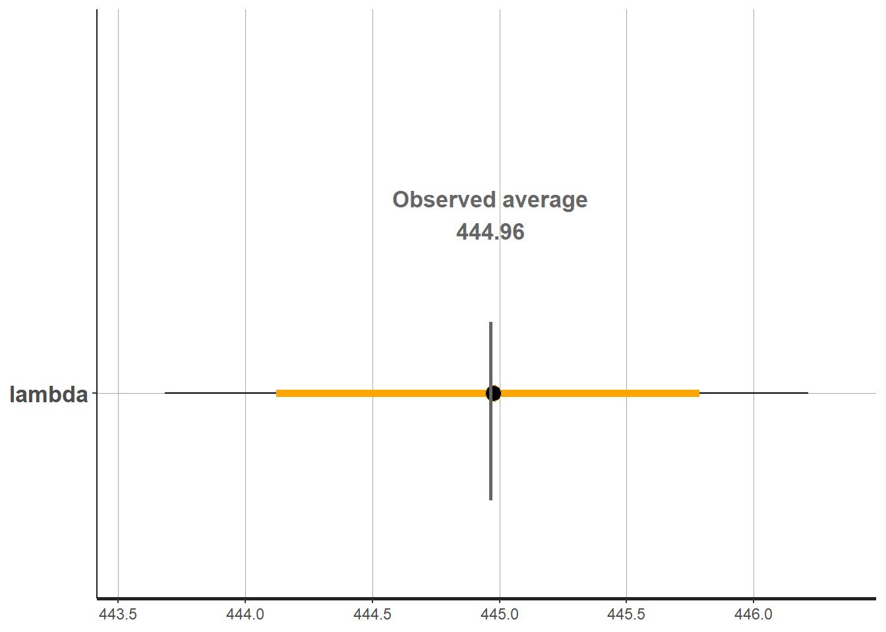
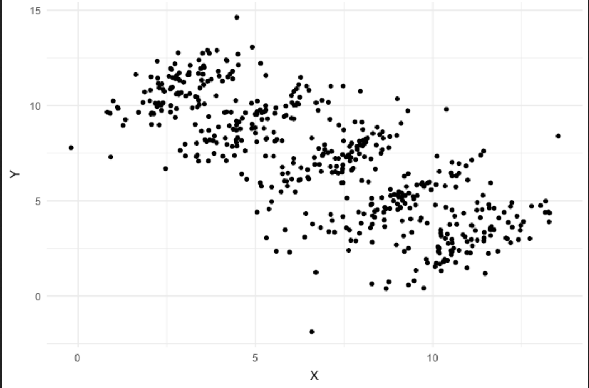
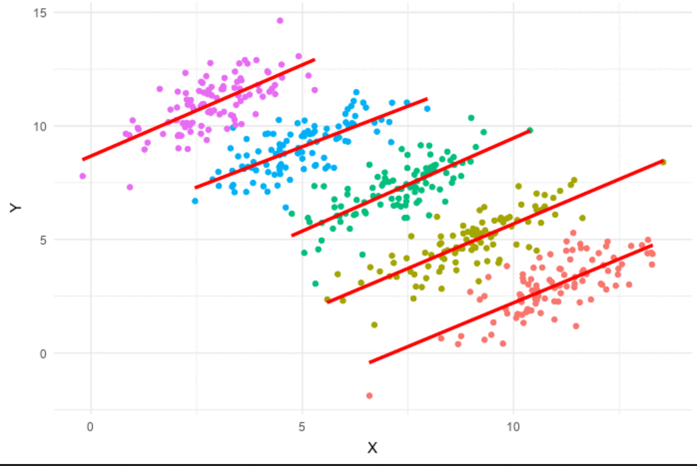
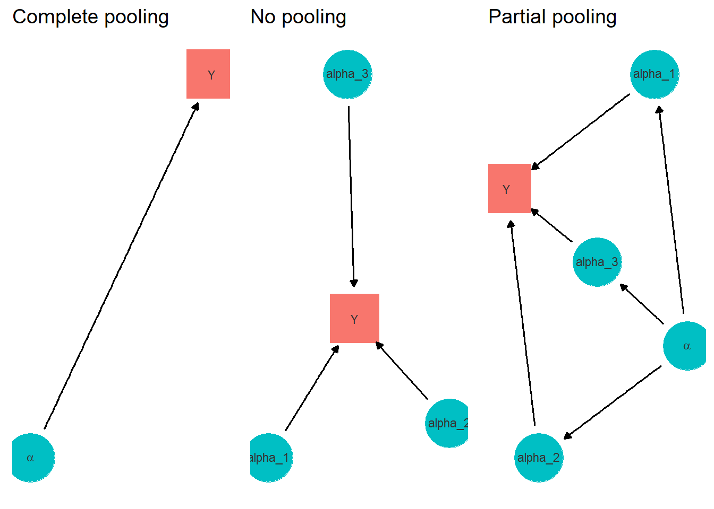
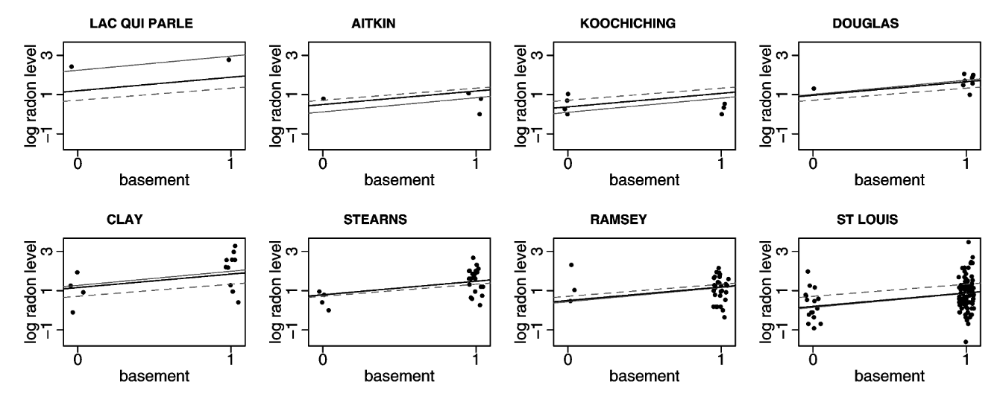
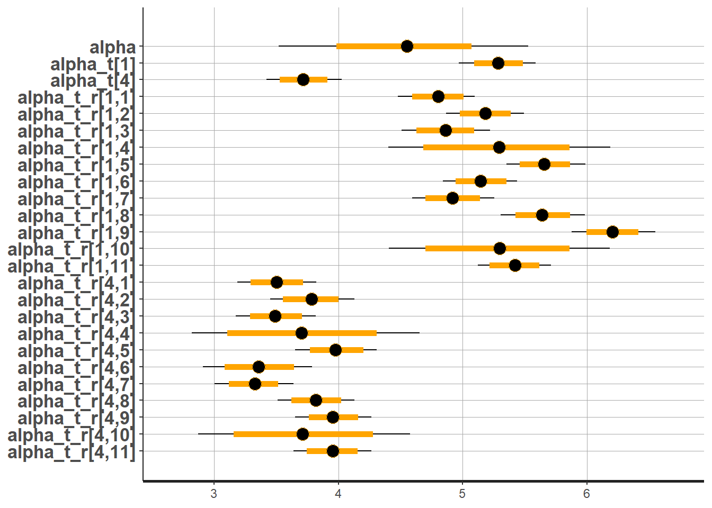

class: inverse, middle, center

```{r setup, include=FALSE}
options(htmltools.dir.version = FALSE)
```

```{r xaringan-themer, include=FALSE, warning=FALSE}
xaringanthemer::style_mono_light(base_color = "#ff8000")
```

```{r xaringanExtra-scribble, echo=FALSE}
xaringanExtra::use_scribble(
  pen_color = "#408000"
)
```

```{r xaringan-logo, echo=FALSE}
xaringanExtra::use_logo(
  image_url = "../../../assets/pic/320px-UNFPA_logo.svg.png",
  position = xaringanExtra::css_position(bottom = "-3.5em", left = "0.5em")
)
```

# Quizz

---
# Practical question

.center2[
Have you finished to read tutorial 1?

1. Yes
2. No
]

---
# Practical question

.center2[
Have you run at least one model in `stan`?

1. Yes
2. No
]


---
layout: true
# Core population model


$$population \sim Poisson( pop\_density * settled\_area)$$

$$pop\_density  \sim Lognormal( \mu, \sigma)$$
---
.center2[
In the core population model, what is $population$?

1. Data
2. Parameter
3. Distribution
]
---
.center2[
In the core population model, what is $settled_area$?

1. Data
2. Parameter
3. Distribution
]
---

.center2[
In the core population model, what is $Lognormal$?

1. Data
2. Parameter
3. Distribution
]

---

.center2[
In the core population model, what is $\mu$?

1. Data
2. Parameter
3. Distribution
]


---

.center2[
In the core population model, what is $pop\_density$?

1. Data
2. Parameter
3. Distribution
]

---
layout: false

# MCMC setting
A common call to `stan` looks like that:

```{r, eval=F}
fit_model2 <- rstan::stan(file = file.path('model.stan'), 
                   data = stan_data_model,
                   iter = warmup + iter, 
                   chains = chains,
                   warmup = warmup, 
                   pars = pars,
                   seed = seed)
```


.center[
Has the `seed` an impact on the estimation process?

1.Yes<br/>
2.No

]

---
# Bayesian output

.pull-left[
#### Plot 1

]
.pull-right[
#### Plot 2

]

.center[Which plot is a traceplot?

1.Plot 1<br/>
2.Plot 2
]

---
# Random modelling

.center2[*Imagine you have two groups of ten people.*

*Group A has an average height of 170 cm*<br/>
*Group B has an average height of 168 cm*

If you randomly select one person from each group who is more likely to be taller?

1. Group A
2. We don't know
]
---
layout: true
# Random modelling


.footnote[Pace~svwiki, CC BY-SA 4.0 <https://commons.wikimedia.org/w/index.php?curid=62007681>]

---
.center[


What is the sign of the relation between x and y?

1.Positif<br/>
2.Negatif
]
---
#### Simpson's Paradox
.center[
]

---
layout: false
# Random vs hierarchical

.center2[


How many models have a random effect?

1. 0
2. 1
3. 2
4. 3
]
---
layout: true
# Random vs hierarchical

$$population \sim Poisson( pop\_density * settled\_area)$$

$$pop\_density \sim Lognormal( \alpha_t, \sigma)$$


$$\alpha_t \sim Normal( 5, 4 )$$
---
.center2[This model represents:
1. A random model
2. A hierarchical model
]
---

.center2[This model is similar to running $n$ models separately:
1. Yes
2. No
]

---
layout:false 

# Random vs hierarchical 

Gelman, Andrew. "Multilevel (hierarchical) modeling: what it can and cannot do." Technometrics 48.3 (2006): 432-435.

.center2[*Radon is a radioactive gas known to cause lung cancer in high concentrations.
Our goal is to estimate*

*(1)  the distribution of radon levels in
each of the approximately 3,000 U.S. counties and* 

*(2) the impact of taking the measurement in the basement*
]
---
# Random vs hierarchical 



.center[
The **dotted** line shows the model under:

1.No-pooling <br/>
2.Complete pooling<br/>
3.Partial pooling
]

---
# Random vs hierarchical 


.center[
The **light-colored** line shows the model under:

1.No-pooling <br/>
2.Complete pooling<br/>
3.Partial pooling
]

---
# Estimation in `stan`

`## Warning in validityMethod(object): The following variables have undefined values: population_hat[1],The following variables have undefined`

.center2[
Is this warning problematic
1. Yes
2. No
]

---
layout: true
# Hierarchically estimated parameters


.pull-left[]

---
.pull-right[What is the estimated **national** population density median (in log)?
1. 3.5
2. 4
3. 4.5
4. 5
5. 5.5
6. 6]
---

.pull-right[What is the estimated population density median for **settlement type 1** (in log)?
1. 3.5
2. 4
3. 4.5
4. 5
5. 5.5
6. 6]

---
layout: false

# Today

.center2[
What do you want to do now?

1. Revisit tutorial 2
2. Present tutorial 3
]
